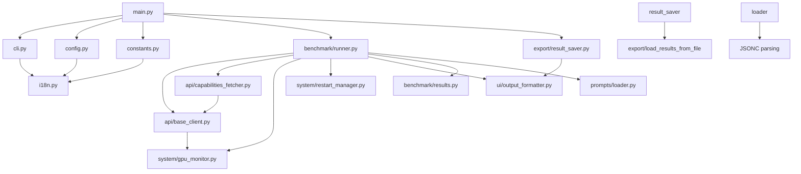

# 🚀 Roo Bench — Context & VRAM Analyzer

[](https://python.org)
[](LICENSE)
[](README_EN.md)

**Professional benchmarking tool for Ollama models with multi-language support (EN/UA)**

📖 **Українська версія:** [README_UA.md](README_UA.md)

---

## Table of Contents

- [Overview](#overview)
- [Installation](#installation)
- [Usage](#usage)
  - [Running via main.py (Recommended)](#running-via-mainpy-recommended)
  - [Running via roo_bench.py (Backward Compatible)](#running-via-roobenchpy-backward-compatible)
  - [Advanced Options](#advanced-options)
  - [Hybrid Prompt System](#hybrid-prompt-system)
  - [Post-Benchmark AI Analysis](#post-benchmark-ai-analysis)
  - [Retest Existing Models](#retest-existing-models)
  - [Updating Capabilities Cache](#updating-capabilities-cache)
- [Configuration](#configuration)
  - [Command-Line Arguments](#command-line-arguments)
  - [Environment Variables](#environment-variables)
  - [Remote Ollama Server Configuration](#remote-ollama-server-configuration)
  - [Remote Ollama Server with SSH Restart](#remote-ollama-server-with-ssh-restart)
  - [Remote VRAM Monitoring via SSH](#remote-vram-monitoring-via-ssh)
- [Command-Line Help Reference](#command-line-help-reference)
- [Architecture](#architecture)
- [Hybrid Prompt System Details](#hybrid-prompt-system-details)
- [Contributing](#contributing)
- [License](#license)
- [Troubleshooting](#troubleshooting)

---

## Overview

Roo Bench is a professional benchmarking tool designed to analyze Ollama models' performance across different context sizes and VRAM usage. It provides detailed metrics including:

- **TPS (Tokens Per Second)** — Speed of text generation
- **VRAM Usage** — GPU memory consumption
- **Performance Classification** — Flying (GPU), Normal, or Slow (RAM/CPU)
- **Multi-language Support** — Ukrainian and English interface
- **Flexible Restart Methods** — systemctl, docker, or custom commands
- **Multiple Benchmark Runs** — Average, min/max statistics
- **Remote Ollama Support** — Connect to Ollama servers on the local network
- **Post-Benchmark AI Analysis** — Get AI-powered recommendations for Roo Code modes
- **Hybrid Prompt System** — Support for independent prompts and prompt chains (Architect → Code → Debug)

## Installation

### Prerequisites

- Python 3.8 or higher
- pip package manager
- Ollama installed and running
- NVIDIA GPU with `nvidia-smi` (optional, for VRAM monitoring)

### Setup

```bash
# Clone the repository
git clone https://github.com/nudykw/roo_bench.git
cd roo-bench

# Create virtual environment
python -m venv venv

# Activate virtual environment
# Linux/macOS (bash/zsh):
source venv/bin/activate
# Windows:
venv\Scripts\activate
# Fish shell:
source venv/bin/activate.fish

# Install dependencies
pip install -r requirements.txt

# Grant execute permission
chmod +x roo_bench.py
```

## Usage

The project uses a modular architecture. You can run it in two ways:

### Running via main.py (Recommended)

```bash
# Run benchmark with all available models
./venv/bin/python main.py

# Run with specific models
./venv/bin/python main.py --models llama3.2,qwen2.5

# Filter models by capabilities
./venv/bin/python main.py --capabilities v  # Only vision models
./venv/bin/python main.py --capabilities T  # Only models with Tools
./venv/bin/python main.py --capabilities t  # Only models with Think (reasoning)
./venv/bin/python main.py --capabilities vT  # Vision + Tools
./venv/bin/python main.py --capabilities vt  # Vision + Think
```

### Running via roo_bench.py (Backward Compatible)

```bash
# All commands work the same way
./venv/bin/python roo_bench.py
./venv/bin/python roo_bench.py --models llama3.2,qwen2.5
```

### Advanced Options

```bash
# Set language (en/ua)
./venv/bin/python roo_bench.py --lang ua

# Choose restart method
./venv/bin/python roo_bench.py --restart-method docker
./venv/bin/python roo_bench.py --restart-method kill_start
./venv/bin/python roo_bench.py --no-restart  # Skip restart

# Multiple benchmark runs for averaging
./venv/bin/python roo_bench.py --num-runs 5

# Custom context sizes (comma-separated)
./venv/bin/python roo_bench.py --context-sizes 8192,16384,32768

# Human-readable format (K for kilobytes, M for megabytes)
./venv/bin/python roo_bench.py --context-sizes 8K,16K,128K,2048K
./venv/bin/python roo_bench.py --context-sizes 1M,2M

# Auto-generate context sizes (geometric progression)
./venv/bin/python roo_bench.py --context-sizes-auto

# Custom temperature values (comma-separated, default: 0.0,0.66,1.0)
./venv/bin/python roo_bench.py --temperature 0.0,0.7,1.0

# Save results to file
./venv/bin/python roo_bench.py --output results.json --output-format json
./venv/bin/python roo_bench.py --output results.csv --output-format csv

# Enable verbose/debug output (use -v, -vv, or -vvv for increasing detail)
./venv/bin/python roo_bench.py -v          # INFO level
./venv/bin/python roo_bench.py -vv         # DEBUG level
./venv/bin/python roo_bench.py -vvv        # DEBUG level (maximum detail)

# Hybrid prompt system options
./venv/bin/python roo_bench.py --list-independent  # List all independent prompts
./venv/bin/python roo_bench.py --list-chains       # List all prompt chains
./venv/bin/python roo_bench.py --independent       # Run only independent prompts
./venv/bin/python roo_bench.py --independent --independent-top 1  # Run only first prompt per mode
./venv/bin/python roo_bench.py --chains            # Run all prompt chains
./venv/bin/python roo_bench.py --chains --chunks-top 1  # Run only first chain
./venv/bin/python roo_bench.py --all               # Run all tests (independent + chains)
./venv/bin/python roo_bench.py --all --prompts-top 1  # Universal limit (replaces --independent-top and --chunks-top)
./venv/bin/python roo_bench.py --chain chain_rest_api  # Run specific chain

# Control generation length (tokens)
./venv/bin/python roo_bench.py --num-predict 16384  # Generate up to 16384 tokens
./venv/bin/python roo_bench.py --num-predict -1     # Unlimited generation (until EOS)

# Analyze saved benchmark results
./venv/bin/python roo_bench.py --analyze-file results.json
./venv/bin/python roo_bench.py --analyze-file results.json --analysis-model qwen2.5

# AI analysis options
./venv/bin/python roo_bench.py --analyze-file results.json --no-stream  # Disable streaming
./venv/bin/python roo_bench.py --no-interactive  # Skip all post-benchmark prompts
```

### Hybrid Prompt System

Roo Bench now supports a **hybrid prompt system** that allows you to define and run both independent prompts and prompt chains.

**Independent Prompts:** Each prompt runs independently without context from other modes. Perfect for testing specific capabilities:

- **Architect Mode** — Design systems and architectures
- **Code Mode** — Implement code solutions
- **Debug Mode** — Find and fix bugs

**Prompt Chains:** Full lifecycle testing with context flow between modes:

```
Architect → Code → Debug
```

**Available Commands:**

```bash
# List all available independent prompts
./venv/bin/python roo_bench.py --list-independent

# List all available prompt chains
./venv/bin/python roo_bench.py --list-chains

# Run independent prompts for all modes
./venv/bin/python roo_bench.py --independent

# Run only the first prompt per mode (limit independent prompts)
./venv/bin/python roo_bench.py --independent --independent-top 1

# Run first two prompts per mode
./venv/bin/python roo_bench.py --independent --independent-top 2

# Run only the first chain (limit chains/chunks)
./venv/bin/python roo_bench.py --chains --chunks-top 1

# Run first two chains
./venv/bin/python roo_bench.py --chains --chunks-top 2

# Universal limit - replaces both --independent-top and --chunks-top
./venv/bin/python roo_bench.py --all --prompts-top 1

# Run a specific prompt chain
./venv/bin/python roo_bench.py --chain chain_rest_api

# Run all prompt chains
./venv/bin/python roo_bench.py --chains

# Run all tests (independent prompts + chains)
./venv/bin/python roo_bench.py --all

# Run with custom prompts file
./venv/bin/python roo_bench.py --prompts-file custom_prompts.md

# Generate Markdown prompt files from JSONC
./venv/bin/python roo_bench.py --generate-md
```

**Prompt Configuration:**

Prompts support two formats with automatic detection:

1. **Markdown format** (recommended, `prompts/prompts.md`):
   - Human-readable and editable
   - Generated from JSONC with `--generate-md`

2. **JSONC format** (`prompts/prompts.jsonc`, fallback):
   - JSON with comments support

**Priority:** `.md` files > `.jsonc` fallback

```jsonc
{
  // Independent prompts for each mode
  "independent": {
    "architect": [...],
    "code": [...],
    "debug": [...]
  },
  // Prompt chains with context flow
  "chains": [
    {
      "id": "chain_rest_api",
      "name": "REST API Server",
      "description": "Full lifecycle: design -> implement -> debug",
      "prompts": {
        "architect": {...},
        "code": {...},
        "debug": {...}
      }
    }
  ]
}
```

```jsonc
{
  // Independent prompts for each mode
  "independent": {
    "architect": [...],
    "code": [...],
    "debug": [...]
  },
  // Prompt chains with context flow
  "chains": [
    {
      "id": "chain_rest_api",
      "name": "REST API Server",
      "description": "Full lifecycle: design -> implement -> debug",
      "prompts": {
        "architect": {...},
        "code": {...},
        "debug": {...}
      }
    }
  ]
}
```

### Post-Benchmark AI Analysis

After completing the benchmark, if you didn't specify `--output`, Roo Bench will offer you to:

1. **Save results** to a JSON file with a custom filename
2. **Send results for AI analysis** — select an Ollama-connected model to analyze your benchmark results

The AI model will provide recommendations for the three main Roo Code modes:

- **🏗️ Architect Mode** — Models that handle large contexts (65K+) well
- **💻 Code Mode** — Models with high TPS for code generation (16K-64K)
- **🐛 Debug Mode** — Balanced models for debugging tasks (<16K)

The analysis response can be automatically translated to your selected language (Ukrainian).

**Example workflow:**
```
=== RECOMMENDATIONS FOR ROO CODE SETUP (TOP 3 OPTIONS) ===
...

Would you like to save the results to a file? (y/n): y
Enter filename (default: benchmark_results.json): my_benchmark.json
Results saved to my_benchmark.json (JSON)

Would you like to send results for AI analysis? (y/n): y

Select a model for analysis (number or name):
  1. llama3.2 (3.0B, 1.8 GB)
  2. qwen2.5 (7B, 4.1 GB)
  3. mistral (7B, 3.9 GB)
  0. Cancel
> 2

Sending request to qwen2.5...

=== AI ANALYSIS FROM qwen2.5 ===
Based on your benchmark results, here are my recommendations...

=== TRANSLATED RESPONSE ===
На основі ваших результатів бенчмарку, ось мої рекомендації...
```

**Disable interactive prompts:**
```bash
# Skip all post-benchmark prompts
./venv/bin/python roo_bench.py --no-interactive
```

### Retest Existing Models

When running benchmarks, Roo Bench can check if a model has already been tested and prompt you for retest decisions. This is useful when:

- You want to re-run specific models with updated prompts
- You want to skip models that have already been tested
- You want to run all remaining models without further prompts

**How it works:**

1. Before testing each model, the system checks if it exists in the results file (`benchmark_results.json` by default)
2. If the model exists, you can choose:
   - **Yes** — Retest this specific model
   - **No** — Skip this model
   - **Yes All** — Retest all remaining models
   - **No All** — Skip all remaining models

**Example workflow:**
```
Testing model: llama3.2 (1/5)
✅ Model 'llama3.2' already tested in benchmark_results.json
Model 'llama3.2' already tested. Retest?
  1. Yes - Retest this model
  2. No - Skip this model
  3. Yes All - Retest all remaining models
  4. No All - Skip all remaining models
Select option (1-4): 2
⏭️  Skipping llama3.2...
```

**Output file:**

The results are saved to `benchmark_results.json` by default. You can specify a custom file with `--output`:

```bash
./venv/bin/python main.py --output my_results.json
```

### Updating Capabilities Cache

Roo Bench automatically caches model capabilities (vision, tools, thinking) in `data/capabilities_cache.json`. You can force an update:

```bash
# Update capabilities cache from Ollama API
./venv/bin/python main.py --update-cache
```

The cache is also automatically saved after model discovery during benchmark runs.

## Configuration

### Command-Line Arguments

| Argument | Description | Default |
|-----|-----|-----|
| `-v, --verbose` | Increase verbosity level (`-v`, `-vv`, `-vvv` for debug output) | 0 |
| `--models` | Comma-separated list of model names | All available |
| `--capabilities, -f` | Filter by capabilities: `v` (vision), `T` (tools), `t` (thinking) | None |
| `--lang` | Interface language: `en` or `ua` | `en` |
| `--restart-method` | Ollama restart method: `systemctl`, `docker`, `kill_start`, `manual`, `ssh` | `manual` |
| `--no-restart` | Skip Ollama restart before benchmark | False |
| `--ssh-host` | SSH host for remote restart (e.g., `user@host`) | None |
| `--ssh-user` | SSH user (optional if user@host format used) | None |
| `--ssh-port` | SSH port | `22` |
| `--ssh-key` | Path to SSH private key (auto-detected if not specified) | None |
| `--num-runs` | Number of benchmark runs per context | `3` |
| `--context-sizes` | Comma-separated context sizes to test (supports `8K`, `16K`, `128K`, `1M` formats) | Auto-detect |
| `--context-sizes-auto` | Auto-generate context sizes | False |
| `--output` | Output file path | None |
| `--output-format` | Output format: `json` or `csv` | None |
| `--ollama-url` | Ollama server URL | `http://localhost:11434` |
| `--ollama-port` | Ollama server port | `11434` |
| `--ollama-api-key` | API key for authentication | None |
| `--ollama-timeout` | Connection timeout in seconds | `300` |
| `--config` | Path to configuration file | `config.json` |
| `--update-cache` | Force update capabilities cache from Ollama API | False |
| `--no-interactive` | Disable interactive post-benchmark prompts | False |
| `--no-thinking` | Disable thinking mode to prevent reasoning loops | True (thinking disabled) |
| `--thinking` | Enable thinking mode on thinking-capable models | False |
| `--analyze-file FILE` | Analyze benchmark results from a saved JSON/CSV file | None |
| `--analysis-model MODEL` | Model name to use for analysis (used with --analyze-file) | None |
| `--no-stream` | Disable streaming mode for AI analysis output | False (streaming enabled) |
| `--list-independent` | List available independent prompts and exit | False |
| `--list-chains` | List available prompt chains and exit | False |
| `--independent` | Run only independent prompts test mode | False |
| `--independent-top N` | Limit the number of independent prompts per mode (e.g., `--independent-top 1` runs only the first prompt per mode) | `None` |
| `--chunks-top N` | Limit the number of prompt chains/chunks to run (e.g., `--chunks-top 1` runs only the first chain) | `None` |
| `--prompts-top N` | Universal limit for both independent prompts and chains (replaces both `--independent-top` and `--chunks-top`) | `None` |
| `--chain CHAIN_ID` | Run only the specified prompt chain (e.g., `chain_rest_api`) | None |
| `--chains` | Run all prompt chains (full lifecycle tests) | False |
| `--all` | Run all tests (independent prompts + chains) in a single run | False |
| `--prompts-file FILE` | Path to prompts configuration file (.md or .jsonc) | `prompts/prompts.md` |
| `--analysis-prompt-file FILE` | Path to analysis prompts file (.md or .jsonc) | Auto-detected |
| `--generate-md` | Generate Markdown prompt files from JSONC configuration files | False |
| `--num-predict` | Maximum tokens to generate per request (use -1 for unlimited) | `12000` |
| `--temperature` | Temperature values to test (comma-separated, e.g., `0.0,0.7,1.0`) | `0.0,0.66,1.0` |

### Environment Variables

```bash
# Set default language
export ROO_BENCH_LANG=ua

# Set default context sizes
export ROO_BENCH_CONTEXT_SIZES="8192,16384,32768"
```

### Remote Ollama Server Configuration

Roo Bench supports connecting to a remote Ollama server on your local network. You can configure this using:

**Option 1: Command-line arguments**
```bash
./venv/bin/python roo_bench.py --ollama-url http://192.168.1.100:11434
./venv/bin/python roo_bench.py --ollama-url http://192.168.1.100:11434 --ollama-api-key your-api-key
```

**Option 2: Environment variables**
```bash
export OLLAMA_URL=http://192.168.1.100:11434
export OLLAMA_API_KEY=your-api-key  # Optional
./venv/bin/python roo_bench.py
```

**Option 3: Configuration file (config.json)**
```bash
./venv/bin/python roo_bench.py --config config.json
```

See [`config.example.json`](config.example.json) for the configuration file structure.

**Configuration Priority:** CLI arguments > Environment variables > Configuration file

### Remote Ollama Server with SSH Restart

Roo Bench supports restarting Ollama on a remote machine via SSH. This is useful when running benchmarks against Ollama servers on different machines.

**Prerequisites:**
- SSH access to the remote machine
- `sudo` access (or NOPASSWD configured for systemctl)
- SSH key recommended (auto-detected from `~/.ssh/`)

**Basic usage:**
```bash
# Restart Ollama on remote machine via SSH
./venv/bin/python roo_bench.py \
  --restart-method ssh \
  --ssh-host user@192.168.1.100 \
  --ollama-url http://192.168.1.100:11434

# With custom SSH port and key
./venv/bin/python roo_bench.py \
  --restart-method ssh \
  --ssh-host user@192.168.1.100 \
  --ssh-port 2222 \
  --ssh-key ~/.ssh/id_ed25519 \
  --ollama-url http://192.168.1.100:11434
```

**Note:** If `--ssh-key` is not specified, the tool auto-detects keys from `~/.ssh/` (ed25519, rsa, dsa, ecdsa in that order).

### Remote VRAM Monitoring via SSH

When using `--ssh-host` for remote Ollama instances, Roo Bench automatically monitors VRAM usage on the remote machine via SSH. This provides accurate GPU memory consumption data instead of showing 0 or local machine values.

**How it works:**
- When `--ssh-host` is specified, VRAM is sampled every 500ms during generation via SSH
- The tool runs `nvidia-smi` on the remote machine and collects maximum VRAM usage
- Results are displayed in MiB (e.g., `VRAM: 8294.0 MiB`)

**Example with remote VRAM monitoring:**
```bash
./venv/bin/python main.py \
  --models qwen3.5:9b \
  --restart-method ssh \
  --ssh-host nudyk@aorus-cachyos-server \
  --ollama-url http://aorus-cachyos-server:11434
```

Expected output:
```
=== BENCHMARK RUNS ===
   Run 1: 11.48 TPS (VRAM: 8294.0 MiB)
   Run 2: 61.13 TPS (VRAM: 8294.0 MiB)
   Run 3: 63.63 TPS (VRAM: 8294.0 MiB)
```

To avoid password prompts, configure NOPASSWD sudo on the remote machine:
```bash
# On remote machine:
echo 'username ALL=(ALL) NOPASSWD: /usr/bin/systemctl' | sudo tee /etc/sudoers.d/ollama
sudo chmod 440 /etc/sudoers.d/ollama
```

## Command-Line Help Reference

Below is the complete `--help` output for reference:

```
usage: main.py [-h] [-v] [--models MODELS] [--capabilities CAPABILITIES]
               [--lang {en,ua}]
               [--restart-method {systemctl,docker,kill_start,manual,ssh}]
               [--ssh-host SSH_HOST] [--ssh-user SSH_USER]
               [--ssh-port SSH_PORT] [--ssh-key SSH_KEY] [--no-restart]
               [--num-runs NUM_RUNS] [--context-sizes CONTEXT_SIZES]
               [--context-sizes-auto] [--output OUTPUT]
               [--output-format {json,csv}] [--ollama-url OLLAMA_URL]
               [--ollama-port OLLAMA_PORT] [--ollama-api-key OLLAMA_API_KEY]
               [--ollama-timeout OLLAMA_TIMEOUT] [--config CONFIG]
               [--update-cache] [--no-interactive] [--analyze-file FILE]
               [--analysis-model ANALYSIS_MODEL] [--no-stream] [--no-thinking]
               [--thinking] [--independent] [--chains] [--chain CHAIN_ID]
               [--prompts-file FILE] [--list-chains] [--list-independent]
               [--independent-top N] [--num-predict NUM_PREDICT]
               [--temperature TEMPERATURE]

Roo Code Model Benchmark

options:
  -h, --help            show this help message and exit
  -v, --verbose         Increase verbosity level (use -v, -vv, -vvv for more
                        debug output)
  --models MODELS       List of models separated by comma
  --capabilities, -f CAPABILITIES
                        Capabilities filter: v (Vision), T (Tools), t (Think).
                        Example: --capabilities vT or -f vT
  --lang {en,ua}        Language (en or ua)
  --restart-method {systemctl,docker,kill_start,manual,ssh}
                        Restart method: systemctl, docker, kill_start, manual
  --ssh-host SSH_HOST   SSH host for remote restart
  --ssh-user SSH_USER   SSH user for remote restart
  --ssh-port SSH_PORT   SSH port for remote restart
  --ssh-key SSH_KEY     Path to SSH private key
  --no-restart          Disable Ollama restart
  --num-runs NUM_RUNS   Number of benchmark runs (default: 3)
  --context-sizes CONTEXT_SIZES
                        Context sizes to test (comma-separated, e.g.,
                        8192,16384,32768)
  --context-sizes-auto  Auto-select context sizes (geometric progression)
  --output OUTPUT       Output file path
  --output-format {json,csv}
                        Output format: json or csv (default: none)
  --ollama-url OLLAMA_URL
                        Ollama server URL
  --ollama-port OLLAMA_PORT
                        Ollama server port
  --ollama-api-key OLLAMA_API_KEY
                        API key for authentication
  --ollama-timeout OLLAMA_TIMEOUT
                        Connection timeout
  --config CONFIG       Path to configuration file
  --update-cache        Force update capabilities cache from Ollama API
  --no-interactive      Disable interactive post-benchmark prompts
  --analyze-file FILE   Analyze benchmark results from a saved JSON/CSV file
  --analysis-model ANALYSIS_MODEL
                        Model name to use for analysis (used with --analyze-
                        file)
  --no-stream           Disable streaming mode for AI analysis output
                        (default: enabled)
  --no-thinking         Disable thinking mode on all models to prevent
                        reasoning loops (default: enabled)
  --thinking            Enable thinking mode on thinking-capable models
  --independent         Run only independent prompts test mode
  --chains              Run all prompt chains (full lifecycle tests)
  --chain CHAIN_ID      Run only the specified prompt chain (e.g.,
                        chain_rest_api)
  --all                 Run all tests (independent prompts + chains)
                        in a single run
  --prompts-file FILE   Path to prompts.jsonc configuration file
  --list-chains         List available prompt chains and exit
  --list-independent    List available independent prompts and exit
  --independent-top N   Limit the number of independent prompts per mode
                        (e.g., --independent-top 1 runs only the first prompt
                        per mode)
  --chunks-top N        Limit the number of prompt chains/chunks to run
                        (e.g., --chunks-top 1 runs only the first chain)
  --prompts-top N       Universal limit for both independent prompts and
                        chains (replaces both --independent-top and
                        --chunks-top)
  --num-predict NUM_PREDICT
                        Maximum number of tokens to predict in generation
                        (default: 12000). Use -1 for unlimited.
  --temperature TEMPERATURE
                        Temperature values to test (comma-separated, e.g.,
                        0.0,0.7,1.0)
```

## Architecture

The project follows a modular architecture with clear separation of concerns:

```
roo_bench/
├── __init__.py
├── main.py                    # Entry point, orchestration
├── cli.py                     # CLI argument parsing
├── config.py                  # Ollama configuration
├── constants.py               # Configuration constants
├── i18n.py                    # Internationalization
│
├── api/
│   ├── __init__.py
│   ├── base_client.py         # Base API client with prompt support
│   ├── capabilities_fetcher.py # Model capabilities fetching
│   └── factory.py             # API client factory
│
├── benchmark/
│   ├── __init__.py
│   ├── runner.py              # Benchmark execution with prompt chains
│   └── results.py             # Statistics calculation
│
├── system/
│   ├── __init__.py
│   ├── gpu_monitor.py         # GPU/VRAM monitoring
│   ├── restart_manager.py     # Ollama restart logic
│   └── ssh_client.py          # SSH client for remote operations
│
├── ui/
│   ├── __init__.py
│   ├── curses_selector.py     # Interactive model selection
│   ├── markdown_renderer.py   # Markdown rendering with stream support
│   ├── output_formatter.py    # Console output formatting
│   └── rich_display.py        # Rich library display (if available)
│
├── export/
│   ├── __init__.py
│   ├── result_saver.py        # JSON/CSV export with prompts_config
│   ├── ai_analyzer.py         # AI-powered analysis
│   └── load_results_from_file # Load results from saved files
│
├── prompts/
│   ├── __init__.py
│   ├── loader.py              # Markdown/JSONC prompt loader
│   ├── analysis_prompt_loader.py # Analysis prompt loader
│   ├── generate_md.py         # Markdown generator from JSONC
│   ├── prompts.md             # Markdown prompt configuration
│   ├── prompts.jsonc          # Prompt configuration (JSONC format, fallback)
│   ├── analysis_prompt.md     # Markdown analysis prompt configuration
│   └── analysis_prompt.jsonc  # Analysis prompt configuration (JSONC format, fallback)
│
└── data/
    └── capabilities_cache.json # Model capabilities cache
```

**Module Dependencies:**



**Key Design Principles:**

| Aspect | Description |
|-----|-----|
| **Separation of Concerns** | Each module has a single, well-defined responsibility |
| **Testability** | Modules can be unit tested independently |
| **Reusability** | Functions can be imported without coupling |
| **Maintainability** | File size reduced from 1030 to 10-200 lines per file |
| **Hybrid Prompts** | Support for both independent prompts and prompt chains |

### Hybrid Prompt System Details

The hybrid prompt system allows you to define prompts in two modes:

**1. Independent Prompts:** Each prompt runs independently without context from other modes. Ideal for testing specific capabilities.

**2. Prompt Chains:** Full lifecycle testing with context flow between modes (Architect → Code → Debug). Each mode receives context from the previous mode.

**Prompt Chain Context Flow:**

```
┌─────────────────┐
│  Architect Mode │
│  (Design)       │
└────────┬────────┘
         │ [ARCHITECT_PLAN]
         ▼
┌─────────────────┐
│  Code Mode      │
│  (Implement)    │
└────────┬────────┘
         │ [CODE_FROM_CODE]
         ▼
┌─────────────────┐
│  Debug Mode     │
│  (Fix Issues)   │
└─────────────────┘
```

**Available Chains (from prompts.jsonc):**

- `chain_rest_api` — REST API Server lifecycle
- `chain_task_queue` — Task Queue System lifecycle
- `chain_websocket_chat` — WebSocket Chat lifecycle

## Contributing

We welcome contributions! Here's how you can help:

1. **Fork the repository**
2. **Create a feature branch** (`git checkout -b feature/amazing-feature`)
3. **Commit your changes** (`git commit -m 'Add amazing feature'`)
4. **Push to the branch** (`git push origin feature/amazing-feature`)
5. **Open a Pull Request**

### Code Style

- Follow PEP 8 guidelines
- Add docstrings to all public functions
- Write tests for new features
- Keep pull requests focused and small

### Reporting Issues

When reporting bugs, please include:
- Ollama version
- Model names being tested
- Python version
- Full error messages
- Steps to reproduce

## License

This project is licensed under the MIT License - see the [LICENSE](LICENSE) file for details.

---

## Troubleshooting

### Common Issues

#### Ollama Connection Errors

**Problem:** `Connection refused` or `Ollama is not running`

**Solutions:**
```bash
# Check if Ollama is running
systemctl status ollama
# or
docker ps | grep ollama

# Restart Ollama
sudo systemctl restart ollama
# or
docker restart ollama
```

#### GPU/VRAM Errors

**Problem:** `nvidia-smi not found` or `No GPU detected`

**Solutions:**
```bash
# Verify NVIDIA drivers are installed
nvidia-smi

# If no GPU available, VRAM monitoring will be disabled
# The tool will continue with RAM-based benchmarks
```

#### Network Errors

**Problem:** `Timeout` or `Connection timeout` when fetching model capabilities

**Solutions:**
```bash
# Check internet connectivity
ping ollama.com

# Verify firewall settings allow outbound connections to port 443
# The tool will fallback to HTML parsing if API is unavailable
```

#### Permission Errors

**Problem:** `Permission denied` when restarting Ollama

**Solutions:**
```bash
# Ensure sudo access is configured
sudo -v

# Or run with elevated privileges
sudo ./venv/bin/python roo_bench.py
```

#### Model Not Found

**Problem:** Model not listed in available models

**Solutions:**
```bash
# Pull the model manually
ollama pull llama3.2

# Verify model is installed
ollama list

# Check Ollama API directly
curl http://localhost:11434/api/tags
```

#### Remote Connection Errors

**Problem:** Cannot connect to remote Ollama server

**Solutions:**
```bash
# Check if the remote server is accessible
curl http://192.168.1.100:11434/api/tags

# Verify firewall allows port 11434
# On the server, ensure Ollama is configured to accept connections:
export OLLAMA_HOST=0.0.0.0:11434
systemctl restart ollama

# Test with simple curl request
curl http://192.168.1.100:11434/api/tags
```

---

## llama.cpp Server Support

Roo Bench supports llama.cpp server via OpenAI-compatible API as an alternative to Ollama.

### Quick Start

```bash
# 1. Start llama.cpp server
./server -m models/llama.gguf --host 127.0.0.1 --port 8080 --jinja

# 2. Run benchmark
python main.py --backend llama_cpp --ollama-url http://127.0.0.1:8080
```

### Remote Server via SSH

```bash
python main.py --backend llama_cpp --ollama-url http://remote-server:8080 \
    --ssh-host remote-server --ssh-user user
```

### Configuration File

```json
{
  "url": "http://localhost:8080",
  "backend_type": "llama_cpp",
  "timeout": 300
}
```

### Environment Variables

```bash
export ROO_BENCH_BACKEND_TYPE=llama_cpp
export OLLAMA_URL=http://localhost:8080
python main.py
```

### Limitations

- Model restart is not supported (skipped automatically)
- GPU monitoring requires `nvidia-smi` (NVIDIA GPUs only)
- Some Ollama-specific metrics are not available

---

📖 **Українська версія:** [README_UA.md](README_UA.md)
