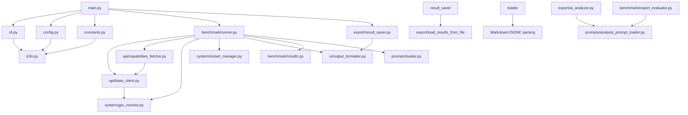

# 🚀 Roo Bench — Аналізатор контексту та VRAM

[](https://python.org)
[](LICENSE)
[](README_UA.md)

**Професійний інструмент бенчмаркінгу для моделей Ollama з багатомовною підтримкою (EN/UA)**

📖 **English version:** [README_EN.md](README_EN.md)

---

## Зміст

- [Огляд](#огляд)
- [Встановлення](#встановлення)
- [Використання](#використання)
  - [Запуск через main.py (Рекомендовано)](#запуск-через-mainpy-рекомендовано)
  - [Запуск через roo_bench.py (Зворотна сумісність)](#запуск-через-roobenchpy-зворотна-сумісність)
  - [Розширені опції](#розширені-опції)
  - [Гібридна система промтів](#гібридна-система-промтів)
  - [AI аналіз після бенчмарку](#ai-аналіз-після-бенчмарку)
  - [Перетестування існуючих моделей](#перетестування-існуючих-моделей)
  - [Оновлення кешу можливостей](#оновлення-кешу-можливостей)
- [Конфігурація](#конфігурація)
  - [Аргументи командного рядка](#аргументи-командного-рядка)
  - [Змінні середовища](#змінні-середовища)
  - [Налаштування віддаленого сервера Ollama](#налаштування-віддаленого-сервера-ollama)
  - [Віддалений перезапуск через SSH](#віддалений-перезапуск-через-ssh)
  - [Моніторинг VRAM через SSH](#моніторинг-vram-через-ssh)
- [Довідка командного рядка](#довідка-командного-рядка)
- [Архітектура](#архітектура)
- [Деталі гібридної системи промтів](#деталі-гібридної-системи-промтів)
- [Участь у розробці](#участь-у-розробці)
- [Ліцензія](#ліцензія)
- [Розв'язання проблем](#розв'язання-проблем)

---

## Огляд

Roo Bench — це професійний інструмент бенчмаркінгу, призначений для аналізу продуктивності моделей Ollama на різних розмірах контексту та використанні VRAM. Він надає детальні метрики, включаючи:

- **TPS (Tokens Per Second)** — Швидкість генерації тексту
- **VRAM Usage** — Споживання пам'яті GPU
- **Класифікація продуктивності** — Flying (GPU), Normal або Slow (RAM/CPU)
- **Багатомовна підтримка** — Український та англійський інтерфейс
- **Гнучкі методи перезапуску** — systemctl, docker або кастомні команди
- **Кілька запусків бенчмарку** — Середнє, min/max статистика
- **Віддалений Ollama** — Підключення до серверів Ollama в локальній мережі
- **AI аналіз після бенчмарку** — Отримання рекомендацій для режимів Roo Code
- **Гібридна система промтів** — Підтримка незалежних промтів та промт-цепочок (Architect → Code → Debug)

## Встановлення

### Вимоги

- Python 3.8 або вище
- Менеджер пакетів pip
- Ollama встановлений і запущений
- NVIDIA GPU з `nvidia-smi` (опціонально, для моніторингу VRAM)

### Налаштування

```bash
# Клонувати репозиторій
git clone https://github.com/nudykw/roo_bench.git
cd roo-bench

# Створити віртуальне середовище
python -m venv venv

# Активувати віртуальне середовище
# Linux/macOS (bash/zsh):
source venv/bin/activate
# Windows:
venv\Scripts\activate
# Fish shell:
source venv/bin/activate.fish

# Встановити залежності
pip install -r requirements.txt

# Надати права виконання
chmod +x roo_bench.py
```

## Використання

Проект використовує модульну архітектуру. Запустити можна двома способами:

### Запуск через main.py (Рекомендовано)

```bash
# Запустити бенчмарк з усіма доступними моделями
./venv/bin/python main.py

# Запустити з конкретними моделями
./venv/bin/python main.py --models llama3.2,qwen2.5

# Фільтрувати моделі за можливостями
./venv/bin/python main.py --capabilities v  # Тільки візіон моделі
./venv/bin/python main.py --capabilities T  # Тільки моделі з інструментами (Tools)
./venv/bin/python main.py --capabilities t  # Тільки моделі з міркуванням (Think)
./venv/bin/python main.py --capabilities vT  # Візіон + Інструменти
./venv/bin/python main.py --capabilities vt  # Візіон + Міркування
```

### Запуск через roo_bench.py (Зворотна сумісність)

```bash
# Усі команди працюють так само
./venv/bin/python roo_bench.py
./venv/bin/python roo_bench.py --models llama3.2,qwen2.5
```

### Розширені опції

```bash
# Встановити мову (en/ua)
./venv/bin/python roo_bench.py --lang ua

# Обрати метод перезапуску
./venv/bin/python roo_bench.py --restart-method docker
./venv/bin/python roo_bench.py --restart-method kill_start
./venv/bin/python roo_bench.py --no-restart  # Пропустити перезапуск

# Кілька запусків бенчмарку для усереднення
./venv/bin/python roo_bench.py --num-runs 5

# Кастомні розміри контексту (через кому)
./venv/bin/python roo_bench.py --context-sizes 8192,16384,32768

# Автоматична генерація розмірів контексту (геометрична прогресія)
./venv/bin/python roo_bench.py --context-sizes-auto

# Кастомні значення температури (через кому, за замовчуванням: 0.0,0.66,1.0)
./venv/bin/python roo_bench.py --temperature 0.0,0.7,1.0

# Зберегти результати у файл
./venv/bin/python roo_bench.py --output results.json --output-format json
./venv/bin/python roo_bench.py --output results.csv --output-format csv

# Увімкнути детальний вивід (використовуйте -v, -vv або -vvv для різного рівня деталізації)
./venv/bin/python roo_bench.py -v          # Рівень INFO
./venv/bin/python roo_bench.py -vv         # Рівень DEBUG
./venv/bin/python roo_bench.py -vvv        # Рівень DEBUG (максимальна деталізація)

# Гібридна система промтів
./venv/bin/python roo_bench.py --list-independent  # Список незалежних промтів
./venv/bin/python roo_bench.py --list-chains       # Список промт-цепочок
./venv/bin/python roo_bench.py --independent       # Тільки незалежні промти
./venv/bin/python roo_bench.py --independent --independent-top 1  # Тільки перший промт на режим
./venv/bin/python roo_bench.py --chain chain_rest_api  # Конкретна цепочка

# Контроль довжини генерації (токени)
./venv/bin/python roo_bench.py --num-predict 16384  # Генерувати до 16384 токенів
./venv/bin/python roo_bench.py --num-predict -1     # Необмежена генерація (до EOS)

# Аналіз збережених результатів бенчмарку
./venv/bin/python roo_bench.py --analyze-file results.json
./venv/bin/python roo_bench.py --analyze-file results.json --analysis-model qwen2.5

# Опції AI аналізу
./venv/bin/python roo_bench.py --analyze-file results.json --no-stream  # Вимкнути потоковий вивід
./venv/bin/python roo_bench.py --no-interactive  # Пропустити всі інтерактивні підказки
```

### Гібридна система промтів

Roo Bench тепер підтримує **гібридну систему промтів**, яка дозволяє визначати та запускати як незалежні промти, так і промт-цепочки.

**Незалежні промти:** Кожен промт запускається окремо без контексту з інших режимів. Ідеально для тестування конкретних можливостей:

- **Режим Architect** — Проектування систем та архітектур
- **Режим Code** — Реалізація коду
- **Режим Debug** — Пошук та виправлення помилок

**Промт-цепочки:** Повний цикл тестування з передачею контексту між режимами:

```
Architect → Code → Debug
```

**Доступні команди:**

```bash
# Список всіх незалежних промтів
./venv/bin/python roo_bench.py --list-independent

# Список всіх промт-цепочок
./venv/bin/python roo_bench.py --list-chains

# Запуск незалежних промтів для всіх режимів
./venv/bin/python roo_bench.py --independent

# Запуск тільки першого промту на режим (обмеження незалежних промтів)
./venv/bin/python roo_bench.py --independent --independent-top 1

# Запуск перших двох промтів на режим
./venv/bin/python roo_bench.py --independent --independent-top 2

# Запуск конкретної промт-цепочки
./venv/bin/python roo_bench.py --chain chain_rest_api

# Запуск всіх промт-цепочок
./venv/bin/python roo_bench.py --chains

# Запуск з кастомним файлом промтів
./venv/bin/python roo_bench.py --prompts-file custom_prompts.jsonc
```

**Конфігурація промтів:**

Промти зберігаються у `prompts/prompts.jsonc` (формат JSONC з підтримкою коментарів):

```jsonc
{
  // Незалежні промти для кожного режиму
  "independent": {
    "architect": [...],
    "code": [...],
    "debug": [...]
  },
  // Промт-цепочки з передачею контексту
  "chains": [
    {
      "id": "chain_rest_api",
      "name": "REST API Server",
      "description": "Повний цикл: дизайн -> реалізація -> відлагодження",
      "prompts": {
        "architect": {...},
        "code": {...},
        "debug": {...}
      }
    }
  ]
}
```

**Підтримка Markdown форматів:**

Roo Bench підтримує Markdown формат для файлів промтів. Markdown файли зручніші для читання та редагування порівняно з JSONC.

**Генерація Markdown файлів:**

```bash
# Згенерувати Markdown файли з JSONC конфігурації
./venv/bin/python roo_bench.py --generate-md
```

Ця команда створить:
- `prompts/prompts.md` — з `prompts/prompts.jsonc`
- `prompts/analysis_prompt.md` — з `prompts/analysis_prompt.jsonc`

**Пріоритет завантаження:**

Система використовує наступний пріоритет при пошуку промтів:
1. Кастомний файл (якщо вказано через `--prompts-file`)
2. `.md` файл (якщо існує)
3. `.jsonc` файл (якщо `.md` не знайдено)

```bash
# Використовувіть .md файл автоматично (якщо існує)
./venv/bin/python roo_bench.py --prompts-file prompts/prompts.md

# Або вкажіть шлях явно
./venv/bin/python roo_bench.py --prompts-file custom_prompts.md

# Використовувати кастомний файл аналізу
./venv/bin/python roo_bench.py --analysis-prompt-file custom_analysis.md
```

**Редагування Markdown файлів:**

Markdown файли мають наступну структуру:

```markdown
# independent

## arch_cache_system
**Name:** Cache System Design
**Description:** Design a thread-safe caching system
**Prompt:** Design a thread-safe caching system...

## code_thread_pool
**Name:** Thread Pool Implementation
**Prompt:** Implement a thread pool...
```

Для промт-цепочок:

```markdown
## chain_rest_api
**Name:** REST API Server
**Description:** Full cycle: design -> implementation -> debugging

- **architect:** Design a REST API...
- **code:** Implement the REST API...
- **debug:** Debug the REST API...
```

### AI аналіз після бенчмарку

Після завершення бенчмарку, якщо ви не вказали `--output`, Roo Bench запропонує вам:

1. **Зберегти результати** у JSON файл з власною назвою
2. **Надіслати результати для AI аналізу** — обрати модель підключену до Ollama для аналізу ваших результатів

AI модель надасть рекомендації для трьох основних режимів Roo Code:

- **🏗️ Режим Architect** — Моделі, що добре працюють з великим контекстом (65K+)
- **💻 Режим Code** — Моделі з високим TPS для генерації коду (16K-64K)
- **🐛 Режим Debug** — Збалансовані моделі для задач відлагодження (<16K)

Відповідь AI може бути автоматично перекладена на обрану мову (українську).

**Приклад роботи:**
```
=== РЕКОМЕНДАЦІЇ ДЛЯ НАЛАШТУВАННЯ ROO CODE (ТОП-3 ВАРІАНТИ) ===
...

Бажаєте зберегти результати у файл? (y/n): y
Введіть ім'я файлу (за замовчуванням: benchmark_results.json): my_benchmark.json
Результати збережено до my_benchmark.json (JSON)

Бажаєте надіслати результати для AI аналізу? (y/n): y

Оберіть модель для аналізу (номер або назва):
  1. llama3.2 (3.0B, 1.8 GB)
  2. qwen2.5 (7B, 4.1 GB)
  3. mistral (7B, 3.9 GB)
  0. Скасувати
> 2

Відправка запиту до qwen2.5...

=== AI АНАЛІЗ ВІД qwen2.5 ===
На основі ваших результатів бенчмарку, ось мої рекомендації...

=== ПЕРЕКЛАДЕНИЙ ВІДПОВІДЬ ===
Based on your benchmark results, here are my recommendations...
```

**Вимкнути інтерактивні підказки:**
```bash
# Пропустити всі інтерактивні підказки після бенчмарку
./venv/bin/python roo_bench.py --no-interactive
```

### Перетестування існуючих моделей

Під час запуску бенчмарку Roo Bench може перевіряти, чи була модель вже протестована, і запитувати про рішення щодо повторного тестування. Це корисно, коли:

- Ви хочете перетестити конкретні моделі з оновленими промптами
- Ви хочете пропустити моделі, які вже були протестовані
- Ви хочете запустити всі залишкові моделі без додаткових запитів

**Як це працює:**

1. Перед тестуванням кожної моделі система перевіряє, чи вона існує в файлі результатів (`benchmark_results.json` за замовчуванням)
2. Якщо модель існує, ви можете обрати:
   - **Так** — Повторити цю конкретну модель
   - **Ні** — Пропустити цю модель
   - **Так усі** — Повторити всі залишкові моделі
   - **Ні усі** — Пропустити всі залишкові моделі

**Приклад роботи:**
```
Testing model: llama3.2 (1/5)
✅ Model 'llama3.2' already tested in benchmark_results.json
Модель 'llama3.2' вже тестувалася. Повторити?
  1. Так - Повторити цю модель
  2. Ні - Пропустити цю модель
  3. Так усі - Повторити всі залишкові моделі
  4. Ні усі - Пропустити всі залишкові моделі
Оберіть опцію (1-4): 2
⏭️  Пропускаємо llama3.2...
```

**Файл виводу:**

Результати зберігаються у `benchmark_results.json` за замовчуванням. Ви можете вказати інший файл за допомогою `--output`:

```bash
./venv/bin/python main.py --output my_results.json
```

### Оновлення кешу можливостей

Roo Bench автоматично кешує можливості моделей (візіон, інструменти, thinking) у `data/capabilities_cache.json`. Ви можете примусово оновити кеш:

```bash
# Оновити кеш можливостей з Ollama API
./venv/bin/python main.py --update-cache
```

Кеш також автоматично зберігається після виявлення моделей під час запусків бенчмарку.

## Конфігурація

### Аргументи командного рядка

| Аргумент | Опис | За замовчуванням |
|-----|-----|-----|
| `-v, --verbose` | Збільшити рівень деталізації (`-v`, `-vv`, `-vvv` для відладки) | 0 |
| `--models` | Список імен моделей через кому | Усі доступні |
| `--capabilities, -f` | Фільтр за можливостями: `v` (візіон), `T` (інструменти), `t` (thinking) | None |
| `--lang` | Мова інтерфейсу: `en` або `ua` | `en` |
| `--restart-method` | Метод перезапуску Ollama: `systemctl`, `docker`, `kill_start`, `manual`, `ssh` | `manual` |
| `--no-restart` | Пропустити перезапуск Ollama перед бенчмарком | False |
| `--ssh-host` | SSH хост для віддаленого перезапуску (напр., `user@host`) | None |
| `--ssh-user` | SSH користувач (опціонально, якщо використовується формат user@host) | None |
| `--ssh-port` | SSH порт | `22` |
| `--ssh-key` | Шлях до приватного SSH ключа (авто-виявлення, якщо не вказано) | None |
| `--num-runs` | Кількість запусків бенчмарку на контекст | `3` |
| `--context-sizes` | Розміри контексту для тестування через кому (підтримується `8K`, `16K`, `128K`, `1M`) | Авто-виявлення |
| `--context-sizes-auto` | Авто-генерація розмірів контексту | False |
| `--output` | Шлях до файлу виводу | None |
| `--output-format` | Формат виводу: `json` або `csv` | None |
| `--ollama-url` | URL сервера Ollama | `http://localhost:11434` |
| `--ollama-port` | Порт сервера Ollama | `11434` |
| `--ollama-api-key` | API ключ для автентифікації | None |
| `--ollama-timeout` | Час очікування підключення (сек) | `300` |
| `--config` | Шлях до файлу конфігурації | `config.json` |
| `--update-cache` | Примусово оновити кеш можливостей з Ollama API | False |
| `--no-interactive` | Вимкнути інтерактивні підказки після бенчмарку | False |
| `--no-thinking` | Вимкнути режим міркувань для запобігання зацикленням | True (thinking вимкнено) |
| `--thinking` | Увімкнути режим міркувань на моделях, що його підтримують | False |
| `--analyze-file FILE` | Аналізувати результати бенчмарку з збереженого JSON/CSV файлу | None |
| `--analysis-model MODEL` | Назва моделі для аналізу (використовується з --analyze-file) | None |
| `--no-stream` | Вимкнути режим потокової передачі для виводу AI аналізу | False (потоковий вивід увімкнено) |
| `--list-independent` | Список доступних незалежних промтів та вихід | False |
| `--list-chains` | Список доступних промт-цепочок та вихід | False |
| `--independent` | Запуск тільки незалежних промтів | False |
| `--independent-top N` | Обмежити кількість незалежних промтів на режим (напр., `--independent-top 1` запускає лише перший промт на режим) | `None` |
| `--chain CHAIN_ID` | Запуск тільки вказаної промт-цепочки (напр., `chain_rest_api`) | None |
| `--chains` | Запустити всі промт-цепочки (повні цикли тестування) | False |
| `--prompts-file FILE` | Шлях до файлу конфігурації промтів (.md або .jsonc) | `prompts.jsonc` |
| `--generate-md` | Згенерувати Markdown-файли промтів з JSONC-конфігурації | False |
| `--analysis-prompt-file FILE` | Шлях до файлу промтів аналізу (.md або .jsonc) | None |
| `--num-predict` | Максимальна кількість токенів для генерації (використовуйте -1 для необмежено) | `12000` |
| `--temperature` | Значення температури для тестування (через кому, наприклад, `0.0,0.7,1.0`) | `0.0,0.66,1.0` |

### Змінні середовища

```bash
# Встановити мову за замовчуванням
export ROO_BENCH_LANG=ua

# Встановити розміри контексту за замовчуванням
export ROO_BENCH_CONTEXT_SIZES="8192,16384,32768"
```

### Налаштування віддаленого сервера Ollama

Roo Bench підтримує підключення до віддаленого сервера Ollama в локальній мережі. Ви можете налаштувати це використовуючи:

**Варіант 1: Аргументи командного рядка**
```bash
./venv/bin/python roo_bench.py --ollama-url http://192.168.1.100:11434
./venv/bin/python roo_bench.py --ollama-url http://192.168.1.100:11434 --ollama-api-key your-api-key
```

**Варіант 2: Змінні середовища**
```bash
export OLLAMA_URL=http://192.168.1.100:11434
export OLLAMA_API_KEY=your-api-key  # Опціонально
./venv/bin/python roo_bench.py
```

**Варіант 3: Файл конфігурації (config.json)**
```bash
./venv/bin/python roo_bench.py --config config.json
```

Дивіться [`config.example.json`](config.example.json) для структури файлу конфігурації.

**Пріоритет конфігурації:** Аргументи CLI > Змінні середовища > Файл конфігурації

### Віддалений перезапуск через SSH

Roo Bench підтримує перезапуск Ollama на віддаленій машині через SSH. Це корисно, коли бенчмарк запускається проти серверів Ollama на різних машинах.

**Передумови:**
- SSH доступ до віддаленої машини
- Доступ `sudo` (або NOPASSWD налаштовано для systemctl)
- Рекомендується SSH ключ (авто-виявлення з `~/.ssh/`)

**Базове використання:**
```bash
# Перезапустити Ollama на віддаленій машині через SSH
./venv/bin/python roo_bench.py \
  --restart-method ssh \
  --ssh-host user@192.168.1.100 \
  --ollama-url http://192.168.1.100:11434

# З нестандартним портом SSH та ключем
./venv/bin/python roo_bench.py \
  --restart-method ssh \
  --ssh-host user@192.168.1.100 \
  --ssh-port 2222 \
  --ssh-key ~/.ssh/id_ed25519 \
  --ollama-url http://192.168.1.100:11434
```

**Примітка:** Якщо `--ssh-key` не вказано, інструмент автоматично виявляє ключі з `~/.ssh/` (ed25519, rsa, dsa, ecdsa у цьому порядку).

### Моніторинг VRAM через SSH

При використанні `--ssh-host` для віддалених екземплярів Ollama, Roo Bench автоматично моніторить використання VRAM на віддаленій машині через SSH. Це забезпечує точні дані про споживання пам'яті GPU замість показу 0 або значень локальної машини.

**Як це працює:**
- При вказаному `--ssh-host` VRAM опитується кожні 500мс під час генерації через SSH
- Інструмент виконує `nvidia-smi` на віддаленій машині і збирає максимальне значення VRAM
- Результати відображаються в MiB (наприклад, `VRAM: 8294.0 MiB`)

**Приклад з моніторингом VRAM:**
```bash
./venv/bin/python main.py \
  --models qwen3.5:9b \
  --restart-method ssh \
  --ssh-host nudyk@aorus-cachyos-server \
  --ollama-url http://aorus-cachyos-server:11434
```

Очікуваний результат:
```
=== ПІДСУМОК БЕНЧМАРКУ ===
   Run 1: 11.48 TPS (VRAM: 8294.0 MiB)
   Run 2: 61.13 TPS (VRAM: 8294.0 MiB)
   Run 3: 63.63 TPS (VRAM: 8294.0 MiB)
```

Щоб уникнути запитів пароля, налаштуйте NOPASSWD sudo на віддаленій машині:
```bash
# На віддаленій машині:
echo 'username ALL=(ALL) NOPASSWD: /usr/bin/systemctl' | sudo tee /etc/sudoers.d/ollama
sudo chmod 440 /etc/sudoers.d/ollama
```

## Довідка командного рядка

Нижче наведено повний вивід `--help` для довідки:

```
usage: main.py [-h] [-v] [--models MODELS] [--capabilities CAPABILITIES]
               [--lang {en,ua}]
               [--restart-method {systemctl,docker,kill_start,manual,ssh}]
               [--ssh-host SSH_HOST] [--ssh-user SSH_USER]
               [--ssh-port SSH_PORT] [--ssh-key SSH_KEY] [--no-restart]
               [--num-runs NUM_RUNS] [--context-sizes CONTEXT_SIZES]
               [--context-sizes-auto] [--output OUTPUT]
               [--output-format {json,csv}] [--ollama-url OLLAMA_URL]
               [--ollama-port OLLAMA_PORT] [--ollama-api-key OLLAMA_API_KEY]
               [--ollama-timeout OLLAMA_TIMEOUT] [--config CONFIG]
               [--update-cache] [--no-interactive] [--analyze-file FILE]
               [--analysis-model ANALYSIS_MODEL] [--analysis-prompt-file FILE]
               [--no-stream] [--no-thinking] [--thinking] [--independent]
               [--chains] [--chain CHAIN_ID] [--prompts-file FILE]
               [--generate-md] [--list-chains] [--list-independent]
               [--independent-top N] [--num-predict NUM_PREDICT]
               [--temperature TEMPERATURE]

Roo Code Model Benchmark

options:
  -h, --help            show this help message and exit
  -v, --verbose         Increase verbosity level (use -v, -vv, -vvv for more
                        debug output)
  --models MODELS       List of models separated by comma
  --capabilities, -f CAPABILITIES
                        Capabilities filter: v (Vision), T (Tools), t (Think).
                        Example: --capabilities vT or -f vT
  --lang {en,ua}        Language (en or ua)
  --restart-method {systemctl,docker,kill_start,manual,ssh}
                        Restart method: systemctl, docker, kill_start, manual
  --ssh-host SSH_HOST   SSH host for remote restart
  --ssh-user SSH_USER   SSH user for remote restart
  --ssh-port SSH_PORT   SSH port for remote restart
  --ssh-key SSH_KEY     Path to SSH private key
  --no-restart          Disable Ollama restart
  --num-runs NUM_RUNS   Number of benchmark runs (default: 3)
  --context-sizes CONTEXT_SIZES
                        Context sizes to test (comma-separated, e.g.,
                        8192,16384,32768)
  --context-sizes-auto  Auto-select context sizes (geometric progression)
  --output OUTPUT       Output file path
  --output-format {json,csv}
                        Output format: json or csv (default: none)
  --ollama-url OLLAMA_URL
                        Ollama server URL
  --ollama-port OLLAMA_PORT
                        Ollama server port
  --ollama-api-key OLLAMA_API_KEY
                        API key for authentication
  --ollama-timeout OLLAMA_TIMEOUT
                        Connection timeout
  --config CONFIG       Path to configuration file
  --update-cache        Force update capabilities cache from Ollama API
  --no-interactive      Disable interactive post-benchmark prompts
  --analyze-file FILE   Analyze benchmark results from a saved JSON/CSV file
  --analysis-model ANALYSIS_MODEL
                        Model name to use for analysis (used with --analyze-
                        file)
  --analysis-prompt-file FILE
                        Path to analysis prompts file (.md or .jsonc)
  --no-stream           Disable streaming mode for AI analysis output
                        (default: enabled)
  --no-thinking         Disable thinking mode on all models to prevent
                        reasoning loops (default: enabled)
  --thinking            Enable thinking mode on thinking-capable models
  --independent         Run only independent prompts test mode
  --chains              Run all prompt chains (full lifecycle tests)
  --chain CHAIN_ID      Run only the specified prompt chain (e.g.,
                        chain_rest_api)
  --prompts-file FILE   Path to prompts configuration file (.md or .jsonc)
  --generate-md         Generate Markdown prompt files from JSONC configuration
  --list-chains         List available prompt chains and exit
  --list-independent    List available independent prompts and exit
  --independent-top N   Limit the number of independent prompts per mode
                        (e.g., --independent-top 1 runs only the first prompt
                        per mode)
  --num-predict NUM_PREDICT
                        Maximum number of tokens to predict in generation
                        (default: 12000). Use -1 for unlimited.
  --temperature TEMPERATURE
                        Temperature values to test (comma-separated, e.g.,
                        0.0,0.7,1.0)
```

## Архітектура

Проект використовує модульну архітектуру з чітким розділенням відповідальності:

```
roo_bench/
├── __init__.py
├── main.py                    # Точка входу, оркестрація
├── cli.py                     # Парсинг аргументів CLI
├── config.py                  # Конфігурація Ollama
├── constants.py               # Константи конфігурації
├── i18n.py                    # Інтернаціоналізація
│
├── api/
│   ├── __init__.py
│   ├── base_client.py         # Базовий клієнт API з підтримкою промтів
│   ├── capabilities_fetcher.py # Отримання можливостей моделей
│   └── factory.py             # Фабрика клієнтів API
│
├── benchmark/
│   ├── __init__.py
│   ├── runner.py              # Виконання бенчмарку з промт-цепочками
│   └── results.py             # Розрахунок статистики
│
├── system/
│   ├── __init__.py
│   ├── gpu_monitor.py         # Моніторинг GPU/VRAM
│   ├── restart_manager.py     # Логіка перезапуску Ollama
│   └── ssh_client.py          # SSH клієнт для віддалених операцій
│
├── ui/
│   ├── __init__.py
│   ├── curses_selector.py     # Інтерактивний вибір моделей
│   ├── markdown_renderer.py   # Рендеринг Markdown з підтримкою stream
│   ├── output_formatter.py    # Форматування виводу
│   └── rich_display.py        # Відображення через rich (якщо доступно)
│
├── export/
│   ├── __init__.py
│   ├── result_saver.py        # Експорт JSON/CSV з prompts_config
│   ├── ai_analyzer.py         # AI аналіз
│   └── load_results_from_file # Завантаження результатів з файлів
│
├── prompts/
│   ├── __init__.py
│   ├── loader.py              # Загрузчик промтів (.md або .jsonc)
│   ├── analysis_prompt_loader.py # Загрузчик промтів аналізу
│   ├── generate_md.py         # Генератор Markdown з JSONC
│   ├── prompts.md             # Markdown конфігурація промтів
│   ├── prompts.jsonc          # Конфігурація промтів (формат JSONC, fallback)
│   ├── analysis_prompt.md     # Markdown конфігурація аналізу
│   └── analysis_prompt.jsonc  # Конфігурація аналізу (формат JSONC, fallback)
│
└── data/
    └── capabilities_cache.json # Кеш можливостей моделей
```

**Залежності модулів:**



**Основні принципи дизайну:**

| Аспект | Опис |
|-----|-----|
| **Розділення відповідальності** | Кожен модуль має чітку, визначену відповідальність |
| **Тестопридатність** | Модулі можна тестувати незалежно |
| **Повторне використання** | Функції можна імпортувати без зв'язків |
| **Підтримуваність** | Розмір файлу зменшено з 1030 до 10-200 рядків на файл |
| **Гібридні промти** | Підтримка як незалежних промтів, так і промт-цепочок |

### Деталі гібридної системи промтів

Гібридна система промтів дозволяє визначати промти в двох режимах:

**1. Незалежні промти:** Кожен промт запускається окремо без контексту з інших режимів. Ідеально для тестування конкретних можливостей.

**2. Промт-цепочки:** Повний цикл тестування з передачею контексту між режимами (Architect → Code → Debug). Кожен режим отримує контекст від попереднього режиму.

**Формати файлів промтів:**

Система підтримує два формати файлів промтів:

- **Markdown (.md)** — пріоритетний формат, зручний для читання та редагування
- **JSONC (.jsonc)** — формат з коментарями, використовується як fallback

Якщо обидва формати існують, система автоматично використовує `.md` файл.

**Генерація Markdown файлів:**

```bash
# Згенерувати Markdown файли з JSONC конфігурації
./venv/bin/python roo_bench.py --generate-md
```

**Передача контексту в промт-цепочці:**

```
┌─────────────────┐
│  Architect Mode │
│  (Design)       │
└────────┬────────┘
         │ [ARCHITECT_PLAN]
         ▼
┌─────────────────┐
│  Code Mode      │
│  (Implement)    │
└────────┬────────┘
         │ [CODE_FROM_CODE]
         ▼
┌─────────────────┐
│  Debug Mode     │
│  (Fix Issues)   │
└─────────────────┘
```

**Доступні цепочки (з prompts.jsonc):**

- `chain_rest_api` — Повний цикл REST API Server
- `chain_task_queue` — Повний цикл Task Queue System
- `chain_websocket_chat` — Повний цикл WebSocket Chat

## Участь у розробці

Ми вітаємо внески! Ось як ви можете допомогти:

1. **Зробіть форк репозиторію**
2. **Створіть гілку для функції** (`git checkout -b feature/amazing-feature`)
3. **Збережіть зміни** (`git commit -m 'Add amazing feature'`)
4. **Надішліть гілку** (`git push origin feature/amazing-feature`)
5. **Відкрийте Pull Request**

### Стиль коду

- Дотримуйтесь рекомендацій PEP 8
- Додавайте docstrings до всіх публічних функцій
- Пишіть тести для нових функцій
- Зберігайте Pull Requests зосередженими та малими

### Звітування про проблеми

При звітуванні про баги, будь ласка, включайте:
- Версію Ollama
- Імена тестованих моделей
- Версію Python
- Повні повідомлення про помилки
- Кроків для відтворення

## Ліцензія

Цей проєкт ліцензовано за ліцензією MIT — дивіться файл [LICENSE](LICENSE) для деталей.

---

## Розв'язання проблем

### Поширені проблеми

#### Помилки підключення до Ollama

**Проблема:** `Connection refused` або `Ollama is not running`

**Розв'язання:**
```bash
# Перевірити, чи запущено Ollama
systemctl status ollama
# або
docker ps | grep ollama

# Перезапустити Ollama
sudo systemctl restart ollama
# або
docker restart ollama
```

#### Помилки GPU/VRAM

**Проблема:** `nvidia-smi not found` або `No GPU detected`

**Розв'язання:**
```bash
# Перевірити, чи встановлено драйвери NVIDIA
nvidia-smi

# Якщо GPU недоступний, моніторинг VRAM буде вимкнено
# Інструмент продовжить роботу з бенчмарками на основі RAM
```

#### Мережеві помилки

**Проблема:** `Timeout` або `Connection timeout` під час отримання можливостей моделей

**Розв'язання:**
```bash
# Перевірити підключення до інтернету
ping ollama.com

# Перевірити налаштування брандмауера, які дозволяють вихідні з'єднання на порт 443
# Інструмент повернеться до парсингу HTML, якщо API недоступний
```

#### Помилки дозволів

**Проблема:** `Permission denied` під час перезапуску Ollama

**Розв'язання:**
```bash
# Переконайтеся, що налаштовано sudo доступ
sudo -v

# Або запустіть з підвищеними привілеями
sudo ./venv/bin/python roo_bench.py
```

#### Модель не знайдено

**Проблема:** Модель не списку доступних моделей

**Розв'язання:**
```bash
# Завантажити модель вручну
ollama pull llama3.2

# Перевірити, чи встановлено модель
ollama list

# Перевірити API Ollama напряму
curl http://localhost:11434/api/tags
```

#### Помилки віддаленого підключення

**Проблема:** Не вдається підключитися до віддаленого сервера Ollama

**Розв'язання:**
```bash
# Перевірити, чи доступний віддалений сервер
curl http://192.168.1.100:11434/api/tags

# Перевірити, чи брандмауер дозволяє порт 11434
# На сервері переконайтеся, що Ollama налаштований приймати з'єднання:
export OLLAMA_HOST=0.0.0.0:11434
systemctl restart ollama

# Протестувати з простим curl запитом
curl http://192.168.1.100:11434/api/tags
```

---

📖 **English version:** [README_EN.md](README_EN.md)
