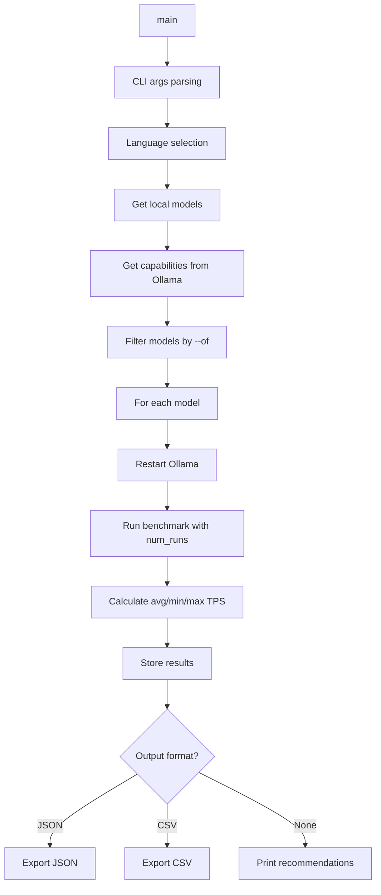

# 🚀 Roo Bench — Context & VRAM Analyzer

[](https://python.org)
[](LICENSE)
[](README.md)

**Professional benchmarking tool for Ollama models with multi-language support (EN/UA)**

---

## 📖 Table of Contents

- [English](#english)
  - [Overview](#overview)
  - [Installation](#installation)
  - [Usage](#usage)
  - [Configuration](#configuration)
  - [Architecture](#architecture)
  - [Contributing](#contributing)
  - [License](#license)
  - [Troubleshooting](#troubleshooting)
- [Українська](#українська)
  - [Огляд](#огляд)
  - [Встановлення](#встановлення)
  - [Використання](#використання)
  - [Конфігурація](#конфігурація)
  - [Архітектура](#архітектура)
  - [Участь у розробці](#участь-у-розробці)
  - [Ліцензія](#ліцензія)
  - [Розв'язання проблем](#розв'язання-проблем)

---

## English

### Overview

Roo Bench is a professional benchmarking tool designed to analyze Ollama models' performance across different context sizes and VRAM usage. It provides detailed metrics including:

- **TPS (Tokens Per Second)** — Speed of text generation
- **VRAM Usage** — GPU memory consumption
- **Performance Classification** — Flying (GPU), Normal, or Slow (RAM/CPU)
- **Multi-language Support** — Ukrainian and English interface
- **Flexible Restart Methods** — systemctl, docker, or custom commands
- **Multiple Benchmark Runs** — Average, min/max statistics
- **Remote Ollama Support** — Connect to Ollama servers on the local network

### Installation

#### Prerequisites

- Python 3.8 or higher
- pip package manager
- Ollama installed and running
- NVIDIA GPU with `nvidia-smi` (optional, for VRAM monitoring)

#### Setup

```bash
# Clone the repository
git clone https://github.com/yourusername/roo-bench.git
cd roo-bench

# Create virtual environment
python -m venv venv

# Activate virtual environment
# Linux/macOS (bash/zsh):
source venv/bin/activate
# Windows:
venv\Scripts\activate
# Fish shell:
source venv/bin/activate.fish

# Install dependencies
pip install -r requirements.txt

# Grant execute permission
chmod +x roo_bench.py
```

### Usage

#### Basic Usage

```bash
# Run benchmark with all available models
./venv/bin/python roo_bench.py

# Run with specific models
./venv/bin/python roo_bench.py --models llama3.2,qwen2.5

# Filter models by capabilities
./venv/bin/python roo_bench.py --of v  # Only vision models
./venv/bin/python roo_bench.py --of T  # Only models with tool use
./venv/bin/python roo_bench.py --of vt  # Vision + Tools
```

#### Advanced Options

```bash
# Set language (en/ua)
./venv/bin/python roo_bench.py --lang ua

# Choose restart method
./venv/bin/python roo_bench.py --restart-method docker
./venv/bin/python roo_bench.py --restart-method kill_start
./venv/bin/python roo_bench.py --no-restart  # Skip restart

# Multiple benchmark runs for averaging
./venv/bin/python roo_bench.py --num-runs 5

# Custom context sizes (comma-separated)
./venv/bin/python roo_bench.py --context-sizes 8192,16384,32768

# Auto-generate context sizes (geometric progression)
./venv/bin/python roo_bench.py --context-sizes-auto

# Save results to file
./venv/bin/python roo_bench.py --output results.json --output-format json
./venv/bin/python roo_bench.py --output results.csv --output-format csv
```

#### Full Example

```bash
# Comprehensive benchmark with all options
./venv/bin/python roo_bench.py \
  --models llama3.2,qwen2.5 \
  --lang ua \
  --of v \
  --num-runs 3 \
  --context-sizes 8192,16384,32768 \
  --output benchmark_results.json \
  --output-format json
```

### Configuration

#### Command-Line Arguments

| Argument | Description | Default |
|----------|-------------|---------|
| `--models` | Comma-separated list of model names | All available |
| `--of` | Filter by capabilities: `v` (vision), `T` (tools), `t` (thinking) | None |
| `--lang` | Interface language: `en` or `ua` | `en` |
| `--restart-method` | Ollama restart method: `systemctl`, `docker`, `kill_start`, `manual` | `systemctl` |
| `--no-restart` | Skip Ollama restart before benchmark | False |
| `--num-runs` | Number of benchmark runs per context | `1` |
| `--context-sizes` | Comma-separated context sizes to test | Auto-detect |
| `--context-sizes-auto` | Auto-generate context sizes | False |
| `--output` | Output file path | None |
| `--output-format` | Output format: `json` or `csv` | None |
| `--ollama-url` | Ollama server URL | `http://localhost:11434` |
| `--ollama-port` | Ollama server port | `11434` |
| `--ollama-api-key` | API key for authentication | None |
| `--ollama-timeout` | Connection timeout in seconds | `300` |
| `--config` | Path to configuration file | `config.json` |

#### Environment Variables

```bash
# Set default language
export ROO_BENCH_LANG=ua

# Set default context sizes
export ROO_BENCH_CONTEXT_SIZES="8192,16384,32768"
```

#### Remote Ollama Server Configuration

Roo Bench supports connecting to a remote Ollama server on your local network. You can configure this using:

**Option 1: Command-line arguments**
```bash
./venv/bin/python roo_bench.py --ollama-url http://192.168.1.100:11434
./venv/bin/python roo_bench.py --ollama-url http://192.168.1.100:11434 --ollama-api-key your-api-key
```

**Option 2: Environment variables**
```bash
export OLLAMA_URL=http://192.168.1.100:11434
export OLLAMA_API_KEY=your-api-key  # Optional
./venv/bin/python roo_bench.py
```

**Option 3: Configuration file (config.json)**
```bash
./venv/bin/python roo_bench.py --config config.json
```

See `config.example.json` for the configuration file structure.

**Configuration Priority:** CLI arguments > Environment variables > Configuration file

### Architecture



### Contributing

We welcome contributions! Here's how you can help:

1. **Fork the repository**
2. **Create a feature branch** (`git checkout -b feature/amazing-feature`)
3. **Commit your changes** (`git commit -m 'Add amazing feature'`)
4. **Push to the branch** (`git push origin feature/amazing-feature`)
5. **Open a Pull Request**

#### Code Style

- Follow PEP 8 guidelines
- Add docstrings to all public functions
- Write tests for new features
- Keep pull requests focused and small

#### Reporting Issues

When reporting bugs, please include:
- Ollama version
- Model names being tested
- Python version
- Full error messages
- Steps to reproduce

### License

This project is licensed under the MIT License - see the [LICENSE](LICENSE) file for details.

---

## Українська

### Огляд

Roo Bench — це професійний інструмент бенчмаркінгу, призначений для аналізу продуктивності моделей Ollama на різних розмірах контексту та використанні VRAM. Він надає детальні метрики, включаючи:

- **TPS (Tokens Per Second)** — Швидкість генерації тексту
- **VRAM Usage** — Споживання пам'яті GPU
- **Класифікація продуктивності** — Flying (GPU), Normal або Slow (RAM/CPU)
- **Багатомовна підтримка** — Український та англійський інтерфейс
- **Гнучкі методи перезапуску** — systemctl, docker або кастомні команди
- **Кілька запусків бенчмарку** — Середнє, min/max статистика

### Встановлення

#### Вимоги

- Python 3.8 або вище
- Менеджер пакетів pip
- Ollama встановлений і запущений
- NVIDIA GPU з `nvidia-smi` (опціонально, для моніторингу VRAM)

#### Налаштування

```bash
# Клонувати репозиторій
git clone https://github.com/yourusername/roo-bench.git
cd roo-bench

# Створити віртуальне середовище
python -m venv venv

# Активувати віртуальне середовище
# Linux/macOS (bash/zsh):
source venv/bin/activate
# Windows:
venv\Scripts\activate
# Fish shell:
source venv/bin/activate.fish

# Встановити залежності
pip install -r requirements.txt

# Надати права виконання
chmod +x roo_bench.py
```

### Використання

#### Базове використання

```bash
# Запустити бенчмарк з усіма доступними моделями
./venv/bin/python roo_bench.py

# Запустити з конкретними моделями
./venv/bin/python roo_bench.py --models llama3.2,qwen2.5

# Фільтрувати моделі за можливостями
./venv/bin/python roo_bench.py --of v  # Тільки візіон моделі
./venv/bin/python roo_bench.py --of T  # Тільки моделі з інструментами
./venv/bin/python roo_bench.py --of vt  # Візіон + Інструменти
```

#### Розширені опції

```bash
# Встановити мову (en/ua)
./venv/bin/python roo_bench.py --lang ua

# Обрати метод перезапуску
./venv/bin/python roo_bench.py --restart-method docker
./venv/bin/python roo_bench.py --restart-method kill_start
./venv/bin/python roo_bench.py --no-restart  # Пропустити перезапуск

# Кілька запусків бенчмарку для усереднення
./venv/bin/python roo_bench.py --num-runs 5

# Кастомні розміри контексту (через кому)
./venv/bin/python roo_bench.py --context-sizes 8192,16384,32768

# Автоматична генерація розмірів контексту (геометрична прогресія)
./venv/bin/python roo_bench.py --context-sizes-auto

# Зберегти результати у файл
./venv/bin/python roo_bench.py --output results.json --output-format json
./venv/bin/python roo_bench.py --output results.csv --output-format csv
```

#### Повний приклад

```bash
# Комплексний бенчмарк з усіма опціями
./venv/bin/python roo_bench.py \
  --models llama3.2,qwen2.5 \
  --lang ua \
  --of v \
  --num-runs 3 \
  --context-sizes 8192,16384,32768 \
  --output benchmark_results.json \
  --output-format json
```

### Конфігурація

#### Аргументи командного рядка

| Аргумент | Опис | За замовчуванням |
|----------|------|------------------|
| `--models` | Список імен моделей через кому | Усі доступні |
| `--of` | Фільтр за можливостями: `v` (візіон), `T` (інструменти), `t` (thinking) | None |
| `--lang` | Мова інтерфейсу: `en` або `ua` | `en` |
| `--restart-method` | Метод перезапуску Ollama: `systemctl`, `docker`, `kill_start`, `manual` | `systemctl` |
| `--no-restart` | Пропустити перезапуск Ollama перед бенчмарком | False |
| `--num-runs` | Кількість запусків бенчмарку на контекст | `1` |
| `--context-sizes` | Розміри контексту для тестування через кому | Авто-виявлення |
| `--context-sizes-auto` | Авто-генерація розмірів контексту | False |
| `--output` | Шлях до файлу виводу | None |
| `--output-format` | Формат виводу: `json` або `csv` | None |
| `--ollama-url` | URL сервера Ollama | `http://localhost:11434` |
| `--ollama-port` | Порт сервера Ollama | `11434` |
| `--ollama-api-key` | API ключ для автентифікації | None |
| `--ollama-timeout` | Час очікування підключення (сек) | `300` |
| `--config` | Шлях до файлу конфігурації | `config.json` |

#### Налаштування віддаленого сервера Ollama

Roo Bench підтримує підключення до віддаленого сервера Ollama в локальній мережі. Ви можете налаштувати це використовуючи:

**Варіант 1: Аргументи командного рядка**
```bash
./venv/bin/python roo_bench.py --ollama-url http://192.168.1.100:11434
./venv/bin/python roo_bench.py --ollama-url http://192.168.1.100:11434 --ollama-api-key your-api-key
```

**Варіант 2: Змінні середовища**
```bash
export OLLAMA_URL=http://192.168.1.100:11434
export OLLAMA_API_KEY=your-api-key  # Опціонально
./venv/bin/python roo_bench.py
```

**Варіант 3: Файл конфігурації (config.json)**
```bash
./venv/bin/python roo_bench.py --config config.json
```

Дивіться `config.example.json` для структури файлу конфігурації.

**Пріоритет конфігурації:** CLI > Змінні середовища > Файл конфігурації

#### Змінні середовища

```bash
# Встановити мову за замовчуванням
export ROO_BENCH_LANG=ua

# Встановити розміри контексту за замовчуванням
export ROO_BENCH_CONTEXT_SIZES="8192,16384,32768"
```

### Архітектура


### Участь у розробці

Ми вітаємо внески! Ось як ви можете допомогти:

1. **Зробіть форк репозиторію**
2. **Створіть гілку для функції** (`git checkout -b feature/amazing-feature`)
3. **Збережіть зміни** (`git commit -m 'Add amazing feature'`)
4. **Надішліть гілку** (`git push origin feature/amazing-feature`)
5. **Відкрийте Pull Request**

#### Стиль коду

- Дотримуйтесь рекомендацій PEP 8
- Додавайте docstrings до всіх публічних функцій
- Пишіть тести для нових функцій
- Зберігайте Pull Requests зосередженими та малими

#### Звітування про проблеми

При звітуванні про баги, будь ласка, включайте:
- Версію Ollama
- Імена тестованих моделей
- Версію Python
- Повні повідомлення про помилки
- Кроків для відтворення

### Ліцензія

Цей проєкт ліцензовано за ліцензією MIT — дивіться файл [LICENSE](LICENSE) для деталей.

---

### Troubleshooting

#### Common Issues

##### Ollama Connection Errors

**Problem:** `Connection refused` or `Ollama is not running`

**Solutions:**
```bash
# Check if Ollama is running
systemctl status ollama
# or
docker ps | grep ollama

# Restart Ollama
sudo systemctl restart ollama
# or
docker restart ollama
```

##### GPU/VRAM Errors

**Problem:** `nvidia-smi not found` or `No GPU detected`

**Solutions:**
```bash
# Verify NVIDIA drivers are installed
nvidia-smi

# If no GPU available, VRAM monitoring will be disabled
# The tool will continue with RAM-based benchmarks
```

##### Network Errors

**Problem:** `Timeout` or `Connection timeout` when fetching model capabilities

**Solutions:**
```bash
# Check internet connectivity
ping ollama.com

# Verify firewall settings allow outbound connections to port 443
# The tool will fallback to HTML parsing if API is unavailable
```

##### Permission Errors

**Problem:** `Permission denied` when restarting Ollama

**Solutions:**
```bash
# Ensure sudo access is configured
sudo -v

# Or run with elevated privileges
sudo ./venv/bin/python roo_bench.py
```

##### Model Not Found

**Problem:** Model not listed in available models

**Solutions:**
```bash
# Pull the model manually
ollama pull llama3.2

# Verify model is installed
ollama list

# Check Ollama API directly
curl http://localhost:11434/api/tags
```

##### Remote Connection Errors

**Problem:** Cannot connect to remote Ollama server

**Solutions:**
```bash
# Check if the remote server is accessible
curl http://192.168.1.100:11434/api/tags

# Verify firewall allows port 11434
# On the server, ensure Ollama is configured to accept connections:
export OLLAMA_HOST=0.0.0.0:11434
systemctl restart ollama

# Test with simple curl request
curl http://192.168.1.100:11434/api/tags
```

---

## 📄 License

MIT License

Copyright (c) 2024 Roo Bench Contributors

Permission is hereby granted, free of charge, to any person obtaining a copy
of this software and associated documentation files (the "Software"), to deal
in the Software without restriction, including without limitation the rights
to use, copy, modify, merge, publish, distribute, sublicense, and/or sell
copies of the Software, and to permit persons to whom the Software is
furnished to do so, subject to the following conditions:

The above copyright notice and this permission notice shall be included in all
copies or substantial portions of the Software.

THE SOFTWARE IS PROVIDED "AS IS", WITHOUT WARRANTY OF ANY KIND, EXPRESS OR
IMPLIED, INCLUDING BUT NOT LIMITED TO THE WARRANTIES OF MERCHANTABILITY,
FITNESS FOR A PARTICULAR PURPOSE AND NONINFRINGEMENT. IN NO EVENT SHALL THE
AUTHORS OR COPYRIGHT HOLDERS BE LIABLE FOR ANY CLAIM, DAMAGES OR OTHER
LIABILITY, WHETHER IN AN ACTION OF CONTRACT, TORT OR OTHERWISE, ARISING FROM,
OUT OF OR IN CONNECTION WITH THE SOFTWARE OR THE USE OR OTHER DEALINGS IN THE
SOFTWARE.
