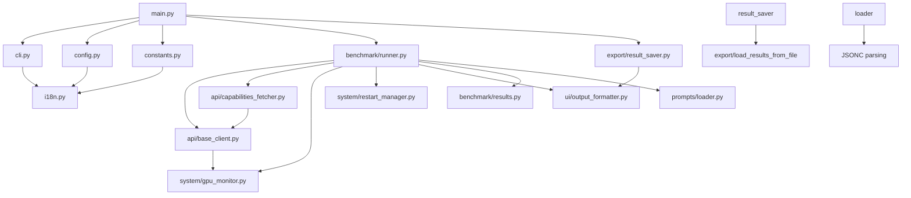

# 🚀 Roo Bench — Context & VRAM Analyzer

[](https://python.org)
[](LICENSE)
[](README.md)

**Professional benchmarking tool for Ollama models with multi-language support (EN/UA)**

---

## 📖 Table of Contents

- [English](#english)
  - [Overview](#overview)
  - [Installation](#installation)
  - [Usage](#usage)
  - [Post-Benchmark AI Analysis](#post-benchmark-ai-analysis)
  - [Hybrid Prompt System](#hybrid-prompt-system)
  - [Updating Capabilities Cache](#updating-capabilities-cache)
  - [Configuration](#configuration)
  - [Architecture](#architecture)
  - [Contributing](#contributing)
  - [License](#license)
  - [Troubleshooting](#troubleshooting)
- [Українська](#українська)
  - [Огляд](#огляд)
  - [Встановлення](#встановлення)
  - [Використання](#використання)
  - [AI аналіз після бенчмарку](#ai-аналіз-після-бенчмарку)
  - [Гібридна система промтів](#гібридна-система-промтів)
  - [Оновлення кешу можливостей](#оновлення-кешу-можливостей)
  - [Конфігурація](#конфігурація)
  - [Архітектура](#архітектура)
  - [Участь у розробці](#участь-у-розробці)
  - [Ліцензія](#ліцензія)
  - [Розв'язання проблем](#розв'язання-проблем)

---

## English

### Overview

Roo Bench is a professional benchmarking tool designed to analyze Ollama models' performance across different context sizes and VRAM usage. It provides detailed metrics including:

- **TPS (Tokens Per Second)** — Speed of text generation
- **VRAM Usage** — GPU memory consumption
- **Performance Classification** — Flying (GPU), Normal, or Slow (RAM/CPU)
- **Multi-language Support** — Ukrainian and English interface
- **Flexible Restart Methods** — systemctl, docker, or custom commands
- **Multiple Benchmark Runs** — Average, min/max statistics
- **Remote Ollama Support** — Connect to Ollama servers on the local network
- **Post-Benchmark AI Analysis** — Get AI-powered recommendations for Roo Code modes
- **Hybrid Prompt System** — Support for independent prompts and prompt chains (Architect → Code → Debug)

### Installation

#### Prerequisites

- Python 3.8 or higher
- pip package manager
- Ollama installed and running
- NVIDIA GPU with `nvidia-smi` (optional, for VRAM monitoring)

#### Setup

```bash
# Clone the repository
git clone https://github.com/yourusername/roo-bench.git
cd roo-bench

# Create virtual environment
python -m venv venv

# Activate virtual environment
# Linux/macOS (bash/zsh):
source venv/bin/activate
# Windows:
venv\Scripts\activate
# Fish shell:
source venv/bin/activate.fish

# Install dependencies
pip install -r requirements.txt

# Grant execute permission
chmod +x roo_bench.py
```

### Usage

The project uses a modular architecture. You can run it in two ways:

#### Running via main.py (Recommended)

```bash
# Run benchmark with all available models
./venv/bin/python main.py

# Run with specific models
./venv/bin/python main.py --models llama3.2,qwen2.5

# Filter models by capabilities
./venv/bin/python main.py --capabilities v  # Only vision models
./venv/bin/python main.py --capabilities T  # Only models with tool use
./venv/bin/python main.py --capabilities vt  # Vision + Tools
```

#### Running via roo_bench.py (Backward Compatible)

```bash
# All commands work the same way
./venv/bin/python roo_bench.py
./venv/bin/python roo_bench.py --models llama3.2,qwen2.5
```

#### Advanced Options

```bash
# Set language (en/ua)
./venv/bin/python roo_bench.py --lang ua

# Choose restart method
./venv/bin/python roo_bench.py --restart-method docker
./venv/bin/python roo_bench.py --restart-method kill_start
./venv/bin/python roo_bench.py --no-restart  # Skip restart

# Multiple benchmark runs for averaging
./venv/bin/python roo_bench.py --num-runs 5

# Custom context sizes (comma-separated)
./venv/bin/python roo_bench.py --context-sizes 8192,16384,32768

# Human-readable format (K for kilobytes, M for megabytes)
./venv/bin/python roo_bench.py --context-sizes 8K,16K,128K,2048K
./venv/bin/python roo_bench.py --context-sizes 1M,2M

# Auto-generate context sizes (geometric progression)
./venv/bin/python roo_bench.py --context-sizes-auto

# Custom temperature values (comma-separated, default: 0.0,0.66,1.0)
./venv/bin/python roo_bench.py --temperature 0.0,0.7,1.0

# Save results to file
./venv/bin/python roo_bench.py --output results.json --output-format json
./venv/bin/python roo_bench.py --output results.csv --output-format csv

# Enable verbose/debug output (use -v, -vv, or -vvv for increasing detail)
./venv/bin/python roo_bench.py -v          # INFO level
./venv/bin/python roo_bench.py -vv         # DEBUG level
./venv/bin/python roo_bench.py -vvv        # DEBUG level (maximum detail)

# Hybrid prompt system options
./venv/bin/python roo_bench.py --list-independent  # List all independent prompts
./venv/bin/python roo_bench.py --list-chains       # List all prompt chains
./venv/bin/python roo_bench.py --independent       # Run only independent prompts
./venv/bin/python roo_bench.py --independent --independent-top 1  # Run only first prompt per mode
./venv/bin/python roo_bench.py --chain chain_rest_api  # Run specific chain

# Control generation length (tokens)
./venv/bin/python roo_bench.py --num-predict 16384  # Generate up to 16384 tokens
./venv/bin/python roo_bench.py --num-predict -1     # Unlimited generation (until EOS)
```

#### Hybrid Prompt System

Roo Bench now supports a **hybrid prompt system** that allows you to define and run both independent prompts and prompt chains.

**Independent Prompts:** Each prompt runs independently without context from other modes. Perfect for testing specific capabilities:

- **Architect Mode** — Design systems and architectures
- **Code Mode** — Implement code solutions
- **Debug Mode** — Find and fix bugs

**Prompt Chains:** Full lifecycle testing with context flow between modes:

```
Architect → Code → Debug
```

**Available Commands:**

```bash
# List all available independent prompts
./venv/bin/python roo_bench.py --list-independent

# List all available prompt chains
./venv/bin/python roo_bench.py --list-chains

# Run independent prompts for all modes
./venv/bin/python roo_bench.py --independent

# Run only the first prompt per mode (limit independent prompts)
./venv/bin/python roo_bench.py --independent --independent-top 1

# Run first two prompts per mode
./venv/bin/python roo_bench.py --independent --independent-top 2

# Run a specific prompt chain
./venv/bin/python roo_bench.py --chain chain_rest_api

# Run with custom prompts file
./venv/bin/python roo_bench.py --prompts-file custom_prompts.jsonc
```

**Prompt Configuration:**

Prompts are stored in `prompts.jsonc` (JSONC format with comment support):

```jsonc
{
  // Independent prompts for each mode
  "independent": {
    "architect": [...],
    "code": [...],
    "debug": [...]
  },
  // Prompt chains with context flow
  "chains": [
    {
      "id": "chain_rest_api",
      "name": "REST API Server",
      "description": "Full lifecycle: design -> implement -> debug",
      "prompts": {
        "architect": {...},
        "code": {...},
        "debug": {...}
      }
    }
  ]
}
```

#### Post-Benchmark AI Analysis

After completing the benchmark, if you didn't specify `--output`, Roo Bench will offer you to:

1. **Save results** to a JSON file with a custom filename
2. **Send results for AI analysis** — select an Ollama-connected model to analyze your benchmark results

The AI model will provide recommendations for the three main Roo Code modes:

- **🏗️ Architect Mode** — Models that handle large contexts (65K+) well
- **💻 Code Mode** — Models with high TPS for code generation (16K-64K)
- **🐛 Debug Mode** — Balanced models for debugging tasks (<16K)

The analysis response can be automatically translated to your selected language (Ukrainian).

**Example workflow:**
```
=== RECOMMENDATIONS FOR ROO CODE SETUP (TOP 3 OPTIONS) ===
...

Would you like to save the results to a file? (y/n): y
Enter filename (default: benchmark_results.json): my_benchmark.json
Results saved to my_benchmark.json (JSON)

Would you like to send results for AI analysis? (y/n): y

Select a model for analysis (number or name):
  1. llama3.2 (3.0B, 1.8 GB)
  2. qwen2.5 (7B, 4.1 GB)
  3. mistral (7B, 3.9 GB)
  0. Cancel
> 2

Sending request to qwen2.5...

=== AI ANALYSIS FROM qwen2.5 ===
Based on your benchmark results, here are my recommendations...

=== TRANSLATED RESPONSE ===
На основі ваших результатів бенчмарку, ось мої рекомендації...
```

**Disable interactive prompts:**
```bash
# Skip all post-benchmark prompts
./venv/bin/python roo_bench.py --no-interactive
```

#### Updating Capabilities Cache

Roo Bench automatically caches model capabilities (vision, tools, thinking) in `data/capabilities_cache.json`. You can force an update:

```bash
# Update capabilities cache from Ollama API
./venv/bin/python main.py --update-cache
```

The cache is also automatically saved after model discovery during benchmark runs.

### Configuration

#### Command-Line Arguments

| Argument | Description | Default |
|-----|-----|-----|
| `-v, --verbose` | Increase verbosity level (`-v`, `-vv`, `-vvv` for debug output) | 0 |
| `--models` | Comma-separated list of model names | All available |
| `--capabilities, -f` | Filter by capabilities: `v` (vision), `T` (tools), `t` (thinking) | None |
| `--lang` | Interface language: `en` or `ua` | `en` |
| `--restart-method` | Ollama restart method: `systemctl`, `docker`, `kill_start`, `manual`, `ssh` | `systemctl` |
| `--no-restart` | Skip Ollama restart before benchmark | False |
| `--ssh-host` | SSH host for remote restart (e.g., `user@host`) | None |
| `--ssh-user` | SSH user (optional if user@host format used) | None |
| `--ssh-port` | SSH port | `22` |
| `--ssh-key` | Path to SSH private key (auto-detected if not specified) | None |
| `--num-runs` | Number of benchmark runs per context | `3` |
| `--context-sizes` | Comma-separated context sizes to test (supports `8K`, `16K`, `128K`, `1M` formats) | Auto-detect |
| `--context-sizes-auto` | Auto-generate context sizes | False |
| `--output` | Output file path | None |
| `--output-format` | Output format: `json` or `csv` | None |
| `--ollama-url` | Ollama server URL | `http://localhost:11434` |
| `--ollama-port` | Ollama server port | `11434` |
| `--ollama-api-key` | API key for authentication | None |
| `--ollama-timeout` | Connection timeout in seconds | `300` |
| `--config` | Path to configuration file | `config.json` |
| `--update-cache` | Force update capabilities cache from Ollama API | False |
| `--no-interactive` | Disable interactive post-benchmark prompts | False |
| `--no-thinking` | Disable thinking mode to prevent reasoning loops | True (thinking disabled) |
| `--thinking` | Enable thinking mode on thinking-capable models | False |
| `--list-independent` | List available independent prompts and exit | False |
| `--list-chains` | List available prompt chains and exit | False |
| `--independent` | Run only independent prompts test mode | False |
| `--independent-top` | Limit the number of independent prompts per mode (e.g., `--independent-top 1` runs only the first prompt per mode) | `None` |
| `--chain` | Run only the specified prompt chain (e.g., `chain_rest_api`) | None |
| `--prompts-file` | Path to prompts.jsonc configuration file | `prompts.jsonc` |
| `--num-predict` | Maximum tokens to generate per request (use -1 for unlimited) | `12000` |

#### Environment Variables

```bash
# Set default language
export ROO_BENCH_LANG=ua

# Set default context sizes
export ROO_BENCH_CONTEXT_SIZES="8192,16384,32768"
```

#### Remote Ollama Server Configuration

Roo Bench supports connecting to a remote Ollama server on your local network. You can configure this using:

**Option 1: Command-line arguments**
```bash
./venv/bin/python roo_bench.py --ollama-url http://192.168.1.100:11434
./venv/bin/python roo_bench.py --ollama-url http://192.168.1.100:11434 --ollama-api-key your-api-key
```

**Option 2: Environment variables**
```bash
export OLLAMA_URL=http://192.168.1.100:11434
export OLLAMA_API_KEY=your-api-key  # Optional
./venv/bin/python roo_bench.py
```

**Option 3: Configuration file (config.json)**
```bash
./venv/bin/python roo_bench.py --config config.json
```

#### Remote Ollama Server with SSH Restart

Roo Bench supports restarting Ollama on a remote machine via SSH. This is useful when running benchmarks against Ollama servers on different machines.

**Prerequisites:**
- SSH access to the remote machine
- `sudo` access (or NOPASSWD configured for systemctl)
- SSH key recommended (auto-detected from `~/.ssh/`)

**Basic usage:**
```bash
# Restart Ollama on remote machine via SSH
./venv/bin/python roo_bench.py \
  --restart-method ssh \
  --ssh-host user@192.168.1.100 \
  --ollama-url http://192.168.1.100:11434

# With custom SSH port and key
./venv/bin/python roo_bench.py \
  --restart-method ssh \
  --ssh-host user@192.168.1.100 \
  --ssh-port 2222 \
  --ssh-key ~/.ssh/id_ed25519 \
  --ollama-url http://192.168.1.100:11434
```

**Note:** If `--ssh-key` is not specified, the tool auto-detects keys from `~/.ssh/` (ed25519, rsa, dsa, ecdsa in that order).

#### Remote VRAM Monitoring via SSH

When using `--ssh-host` for remote Ollama instances, Roo Bench automatically monitors VRAM usage on the remote machine via SSH. This provides accurate GPU memory consumption data instead of showing 0 or local machine values.

**How it works:**
- When `--ssh-host` is specified, VRAM is sampled every 500ms during generation via SSH
- The tool runs `nvidia-smi` on the remote machine and collects maximum VRAM usage
- Results are displayed in MiB (e.g., `VRAM: 8294.0 MiB`)

**Example with remote VRAM monitoring:**
```bash
./venv/bin/python main.py \
  --models qwen3.5:9b \
  --restart-method ssh \
  --ssh-host nudyk@aorus-cachyos-server \
  --ollama-url http://aorus-cachyos-server:11434
```

Expected output:
```
=== BENCHMARK RUNS ===
   Run 1: 11.48 TPS (VRAM: 8294.0 MiB)
   Run 2: 61.13 TPS (VRAM: 8294.0 MiB)
   Run 3: 63.63 TPS (VRAM: 8294.0 MiB)
```

To avoid password prompts, configure NOPASSWD sudo on the remote machine:
```bash
# On remote machine:
echo 'username ALL=(ALL) NOPASSWD: /usr/bin/systemctl' | sudo tee /etc/sudoers.d/ollama
sudo chmod 440 /etc/sudoers.d/ollama
```

See `config.example.json` for the configuration file structure.

**Configuration Priority:** CLI arguments > Environment variables > Configuration file

### Architecture

The project follows a modular architecture with clear separation of concerns:

```
roo_bench/
├── __init__.py
├── main.py                    # Entry point, orchestration
├── cli.py                     # CLI argument parsing
├── config.py                  # Ollama configuration
├── constants.py               # Configuration constants
├── i18n.py                    # Internationalization
│
├── api/
│   ├���─ __init__.py
│   ├── base_client.py         # Base API client with prompt support
│   ├── capabilities_fetcher.py # Model capabilities fetching
│   └── factory.py             # API client factory
│
├── benchmark/
│   ├── __init__.py
│   ├── runner.py              # Benchmark execution with prompt chains
│   └── results.py             # Statistics calculation
│
├── system/
│   ├── __init__.py
│   ├── gpu_monitor.py         # GPU/VRAM monitoring
│   ├── restart_manager.py     # Ollama restart logic
│   └── ssh_client.py          # SSH client for remote operations
│
├── ui/
│   ├── __init__.py
│   ├── curses_selector.py     # Interactive model selection
│   ├── markdown_renderer.py   # Markdown rendering with stream support
│   ├── output_formatter.py    # Console output formatting
│   └── rich_display.py        # Rich library display (if available)
│
├── export/
│   ├── __init__.py
│   ├── result_saver.py        # JSON/CSV export with prompts_config
│   ├── ai_analyzer.py         # AI-powered analysis
│   └── load_results_from_file # Load results from saved files
│
├── prompts/
│   ├── __init__.py
│   ├── loader.py              # JSONC prompt loader
│   └── prompts.jsonc          # Prompt configuration (JSONC format)
│
└── data/
    └── capabilities_cache.json # Model capabilities cache
```

**Module Dependencies:**



**Key Design Principles:**

| Aspect | Description |
|-----|-----|
| **Separation of Concerns** | Each module has a single, well-defined responsibility |
| **Testability** | Modules can be unit tested independently |
| **Reusability** | Functions can be imported without coupling |
| **Maintainability** | File size reduced from 1030 to 10-200 lines per file |
| **Hybrid Prompts** | Support for both independent prompts and prompt chains |

### Hybrid Prompt System Details

The hybrid prompt system allows you to define prompts in two modes:

**1. Independent Prompts:** Each prompt runs independently without context from other modes. Ideal for testing specific capabilities.

**2. Prompt Chains:** Full lifecycle testing with context flow between modes (Architect → Code → Debug). Each mode receives context from the previous mode.

**Prompt Chain Context Flow:**

```
┌─────────────────┐
│  Architect Mode │
│  (Design)       │
└────────┬────────┘
         │ [ARCHITECT_PLAN]
         ▼
┌─────────────────┐
│  Code Mode      │
│  (Implement)    │
└────────┬────────┘
         │ [CODE_FROM_CODE]
         ▼
┌─────────────────┐
│  Debug Mode     │
│  (Fix Issues)   │
└─────────────────┘
```

**Available Chains (from prompts.jsonc):**

- `chain_rest_api` — REST API Server lifecycle
- `chain_task_queue` — Task Queue System lifecycle
- `chain_websocket_chat` — WebSocket Chat lifecycle

### Contributing

We welcome contributions! Here's how you can help:

1. **Fork the repository**
2. **Create a feature branch** (`git checkout -b feature/amazing-feature`)
3. **Commit your changes** (`git commit -m 'Add amazing feature'`)
4. **Push to the branch** (`git push origin feature/amazing-feature`)
5. **Open a Pull Request**

#### Code Style

- Follow PEP 8 guidelines
- Add docstrings to all public functions
- Write tests for new features
- Keep pull requests focused and small

#### Reporting Issues

When reporting bugs, please include:
- Ollama version
- Model names being tested
- Python version
- Full error messages
- Steps to reproduce

### License

This project is licensed under the MIT License - see the [LICENSE](LICENSE) file for details.

---

## Українська

### Огляд

Roo Bench — це професійний інструмент бенчмаркінгу, призначений для аналізу продуктивності моделей Ollama на різних розмірах контексту та використанні VRAM. Він надає детальні метрики, включаючи:

- **TPS (Tokens Per Second)** — Швидкість генерації тексту
- **VRAM Usage** — Споживання пам'яті GPU
- **Класифікація продуктивності** — Flying (GPU), Normal або Slow (RAM/CPU)
- **Багатомовна підтримка** — Український та англійський інтерфейс
- **Гнучкі методи перезапуску** — systemctl, docker або кастомні команди
- **Кілька запусків бенчмарку** — Середнє, min/max статистика
- **Віддалений Ollama** �� Підключення до серверів Ollama в локальній мережі
- **AI аналіз після бенчмарку** — Отримання рекомендацій для режимів Roo Code
- **Гібридна система промтів** — Підтримка незалежних промтів та промт-цепочок (Architect → Code → Debug)

### Встановлення

#### Вимоги

- Python 3.8 або вище
- Менеджер пакетів pip
- Ollama встановлений і запущений
- NVIDIA GPU з `nvidia-smi` (опціонально, для моніторингу VRAM)

#### Налаштування

```bash
# Клонувати репозиторій
git clone https://github.com/yourusername/roo-bench.git
cd roo-bench

# Створити віртуальне середовище
python -m venv venv

# Активувати віртуальне середовище
# Linux/macOS (bash/zsh):
source venv/bin/activate
# Windows:
venv\Scripts\activate
# Fish shell:
source venv/bin/activate.fish

# Встановити залежності
pip install -r requirements.txt

# Надати права виконання
chmod +x roo_bench.py
```

### Використання

Проект використовує модульну архітектуру. Запустити можна двома способами:

#### Запуск через main.py (Рекомендовано)

```bash
# Запустити бенчмарк з усіма доступними моделями
./venv/bin/python main.py

# Запустити з конкретними моделями
./venv/bin/python main.py --models llama3.2,qwen2.5

# Фільтрувати моделі за можливостями
./venv/bin/python main.py --capabilities v  # Тільки візіон моделі
./venv/bin/python main.py --capabilities T  # Тільки моделі з інструментами
./venv/bin/python main.py --capabilities vt  # Візіон + Інструменти
```

#### Запуск через roo_bench.py (Зворотна сумісність)

```bash
# Усі команди працюють так само
./venv/bin/python roo_bench.py
./venv/bin/python roo_bench.py --models llama3.2,qwen2.5
```

#### Розширені опції

```bash
# Встановити мову (en/ua)
./venv/bin/python roo_bench.py --lang ua

# Обрати метод перезапуску
./venv/bin/python roo_bench.py --restart-method docker
./venv/bin/python roo_bench.py --restart-method kill_start
./venv/bin/python roo_bench.py --no-restart  # Пропустити перезапуск

# Кілька запусків бенчмарку для усереднення
./venv/bin/python roo_bench.py --num-runs 5

# Кастомні розміри контексту (через кому)
./venv/bin/python roo_bench.py --context-sizes 8192,16384,32768

# Автоматична генерація розмірів контексту (геометрична прогресія)
./venv/bin/python roo_bench.py --context-sizes-auto

# Кастомні значення температури (через кому, за замовчуванням: 0.0,0.66,1.0)
./venv/bin/python roo_bench.py --temperature 0.0,0.7,1.0

# Зберегти результати у файл
./venv/bin/python roo_bench.py --output results.json --output-format json
./venv/bin/python roo_bench.py --output results.csv --output-format csv

# Увімкнути детальний вивід (використовуйте -v, -vv або -vvv для різного рівня деталізації)
./venv/bin/python roo_bench.py -v          # Рівень INFO
./venv/bin/python roo_bench.py -vv         # Рівень DEBUG
./venv/bin/python roo_bench.py -vvv        # Рівень DEBUG (максимальна деталізація)

# Гібридна система промтів
./venv/bin/python roo_bench.py --list-independent  # Список незалежних промтів
./venv/bin/python roo_bench.py --list-chains       # Список промт-цепочок
./venv/bin/python roo_bench.py --independent       # Тільки незалежні промти
./venv/bin/python roo_bench.py --independent --independent-top 1  # Тільки перший промт на режим
./venv/bin/python roo_bench.py --chain chain_rest_api  # Конкретна цепочка

# Контроль довжини генерації (токени)
./venv/bin/python roo_bench.py --num-predict 16384  # Генерувати до 16384 токенів
./venv/bin/python roo_bench.py --num-predict -1     # Необмежена генерація (до EOS)
```

#### Гібридна система промтів

Roo Bench тепер підтримує **гібридну систему промтів**, яка дозволяє визначати та запускати як незалежні промти, так і промт-цепочки.

**Незалежні промти:** Кожен промт запускається окремо без контексту з інших режимів. Ідеально для тестування конкретних можливостей:

- **Режим Architect** — Проектування систем та архітектур
- **Режим Code** — Реалізація коду
- **Режим Debug** — Пошук та виправлення помилок

**Промт-цепочки:** Повний цикл тестування з передачею контексту між режимами:

```
Architect → Code → Debug
```

**Доступні команди:**

```bash
# Список всіх незалежних промтів
./venv/bin/python roo_bench.py --list-independent

# Список всіх промт-цепочок
./venv/bin/python roo_bench.py --list-chains

# Запуск незалежних промтів для всіх режимів
./venv/bin/python roo_bench.py --independent

# Запуск конкретної промт-цепочки
./venv/bin/python roo_bench.py --chain chain_rest_api

# Запуск з кастомним файлом промтів
./venv/bin/python roo_bench.py --prompts-file custom_prompts.jsonc
```

**Конфігурація промтів:**

Промти зберігаються у `prompts.jsonc` (формат JSONC з підтримкою коментарів):

```jsonc
{
  // Незалежні промти для кожного режиму
  "independent": {
    "architect": [...],
    "code": [...],
    "debug": [...]
  },
  // Промт-цепочки з передачею контексту
  "chains": [
    {
      "id": "chain_rest_api",
      "name": "REST API Server",
      "description": "Повний цикл: дизайн -> реалізація -> відлагодження",
      "prompts": {
        "architect": {...},
        "code": {...},
        "debug": {...}
      }
    }
  ]
}
```

#### AI аналіз після бенчмарку

Після завершення бенчмарку, якщо ви не вказали `--output`, Roo Bench запропонує вам:

1. **Зберегти результати** у JSON файл з власною назвою
2. **Надіслати результати для AI аналізу** — обрати модель підключену до Ollama для аналізу ваших результатів

AI модель надасть рекомендації для трьох основних режимів Roo Code:

- **🏗️ Режим Architect** — Моделі, що добре працюють з великим контекстом (65K+)
- **💻 Режим Code** — Моделі з високим TPS для генерації коду (16K-64K)
- **🐛 Режим Debug** — Збалансовані моделі для задач відлагодження (<16K)

Відповідь AI може бути автоматично перекладена на обрану мову (українську).

**Приклад роботи:**
```
=== РЕКОМЕНДАЦІЇ ДЛЯ НАЛАШТУВАННЯ ROO CODE (ТОП-3 ВАРІАНТИ) ===
...

Бажаєте зберегти результати у файл? (y/n): y
Введіть ім'я файлу (за замовчуванням: benchmark_results.json): my_benchmark.json
Результати збережено до my_benchmark.json (JSON)

Бажаєте надіслати результати для AI аналізу? (y/n): y

Оберіть модель для аналізу (номер або назва):
  1. llama3.2 (3.0B, 1.8 GB)
  2. qwen2.5 (7B, 4.1 GB)
  3. mistral (7B, 3.9 GB)
  0. Скасувати
> 2

Відправка запиту до qwen2.5...

=== AI АНАЛІЗ ВІД qwen2.5 ===
На основі ваших результатів бенчмарку, ось мої рекомендації...

=== ПЕРЕКЛАДЕНИЙ ВІДПОВІДЬ ===
Based on your benchmark results, here are my recommendations...
```

**Вимкнути інтерактивні підказки:**
```bash
# Пропустити всі інтерактивні підказки після бенчмарку
./venv/bin/python roo_bench.py --no-interactive
```

#### Оновлення кешу можливостей

Roo Bench автоматично кешує можливості моделей (візіон, інструменти, thinking) у `data/capabilities_cache.json`. Ви можете примусово оновити кеш:

```bash
# Оновити кеш можливостей з Ollama API
./venv/bin/python main.py --update-cache
```

Кеш також автоматично зберігається після виявлення моделей під час запусків бенчмарку.

### Конфігурація

#### Аргументи командного рядка

| Аргумент | Опис | За замовчуванням |
|-----|-----|-----|
| `-v, --verbose` | Збільшити рівень деталізації (`-v`, `-vv`, `-vvv` для відладки) | 0 |
| `--models` | Список імен моделей через кому | Усі доступні |
| `--capabilities, -f` | Фільтр за можливостями: `v` (візіон), `T` (інструменти), `t` (thinking) | None |
| `--lang` | Мова інтерфейсу: `en` або `ua` | `en` |
| `--restart-method` | Метод перезапуску Ollama: `systemctl`, `docker`, `kill_start`, `manual`, `ssh` | `systemctl` |
| `--no-restart` | Пропустити перезапуск Ollama перед бенчмарком | False |
| `--ssh-host` | SSH хост для віддаленого перезапуску (напр., `user@host`) | None |
| `--ssh-user` | SSH користувач (опціонально, якщо використовується формат user@host) | None |
| `--ssh-port` | SSH порт | `22` |
| `--ssh-key` | Шлях до приватного SSH ключа (авто-виявлення, якщо не вказано) | None |
| `--num-runs` | Кількість запусків бенчмарку на контекст | `3` |
| `--context-sizes` | Розміри контексту для тестування через кому (підтримується `8K`, `16K`, `128K`, `1M`) | Авто-виявлення |
| `--context-sizes-auto` | Авто-генерація розмірів контексту | False |
| `--output` | Шлях до файлу виводу | None |
| `--output-format` | Формат виводу: `json` або `csv` | None |
| `--ollama-url` | URL сервера Ollama | `http://localhost:11434` |
| `--ollama-port` | Порт сервера Ollama | `11434` |
| `--ollama-api-key` | API ключ для автентифікації | None |
| `--ollama-timeout` | Час очікування підключення (сек) | `300` |
| `--config` | Шлях до файлу конфігурації | `config.json` |
| `--update-cache` | Примусово оновити кеш можливостей з Ollama API | False |
| `--no-interactive` | Вимкнути інтерактивні підказки після бенчмарку | False |
| `--no-thinking` | Вимкнути режим міркувань для запобігання зацикленням | True (thinking вимкнено) |
| `--thinking` | Увімкнути режим міркувань на моделях, що його підтримують | False |
| `--list-independent` | Список доступних незалежних промтів та вихід | False |
| `--list-chains` | Список доступних промт-цепочок та вихід | False |
| `--independent` | Запуск тільки незалежних промтів | False |
| `--independent-top` | Обмежити кількість незалежних промтів на режим (напр., `--independent-top 1` запускає лише перший промт на режим) | `None` |
| `--chain` | Запуск тільки вказаної промт-цепочки (напр., `chain_rest_api`) | None |
| `--prompts-file` | Шлях до файлу конфігурації промтів | `prompts.jsonc` |
| `--num-predict` | Максимальна кількість токенів для генерації (використовуйте -1 для необмежено) | `12000` |

#### Налаштування віддаленого сервера Ollama

Roo Bench підтримує підключення до віддаленого сервера Ollama в локальній мережі. Ви можете налаштувати це використовуючи:

**Варіант 1: Аргументи командного рядка**
```bash
./venv/bin/python roo_bench.py --ollama-url http://192.168.1.100:11434
./venv/bin/python roo_bench.py --ollama-url http://192.168.1.100:11434 --ollama-api-key your-api-key
```

**Варіант 2: Змінні середовища**
```bash
export OLLAMA_URL=http://192.168.1.100:11434
export OLLAMA_API_KEY=your-api-key  # Опціонально
./venv/bin/python roo_bench.py
```

**Варіант 3: Файл конфігурації (config.json)**
```bash
./venv/bin/python roo_bench.py --config config.json
```

#### Віддалений перезапуск через SSH

Roo Bench підтримує перезапуск Ollama на віддаленій машині через SSH. Це корисно, коли бенчмарк запускається проти серверів Ollama на різних машинах.

**Передумови:**
- SSH доступ до віддаленої машини
- Доступ `sudo` (або NOPASSWD налаштовано для systemctl)
- Рекомендується SSH ключ (авто-виявлення з `~/.ssh/`)

**Базове використання:**
```bash
# Перезапустити Ollama на віддаленій машині через SSH
./venv/bin/python roo_bench.py \
  --restart-method ssh \
  --ssh-host user@192.168.1.100 \
  --ollama-url http://192.168.1.100:11434

# З нестандартним портом SSH та ключем
./venv/bin/python roo_bench.py \
  --restart-method ssh \
  --ssh-host user@192.168.1.100 \
  --ssh-port 2222 \
  --ssh-key ~/.ssh/id_ed25519 \
  --ollama-url http://192.168.1.100:11434
```

**Примітка:** Якщо `--ssh-key` не вказано, інструмент автоматично виявляє ключі з `~/.ssh/` (ed25519, rsa, dsa, ecdsa у цьому порядку).

#### Моніторинг VRAM через SSH

При використанні `--ssh-host` для віддалених екземплярів Ollama, Roo Bench автоматично моніторить використання VRAM на віддаленій машині через SSH. Це забезпечує точні дані про споживання пам'яті GPU замість показу 0 або значень локальної машини.

**Як це працює:**
- При вказаному `--ssh-host` VRAM опитується кожні 500мс під час генерації через SSH
- Інструмент виконує `nvidia-smi` на віддаленій машині і збирає максимальне значення VRAM
- Результати відображаються в MiB (наприклад, `VRAM: 8294.0 MiB`)

**Приклад з моніторингом VRAM:**
```bash
./venv/bin/python main.py \
  --models qwen3.5:9b \
  --restart-method ssh \
  --ssh-host nudyk@aorus-cachyos-server \
  --ollama-url http://aorus-cachyos-server:11434
```

Очікуваний результат:
```
=== ПІДСУМОК БЕНЧМАРКУ ===
   Run 1: 11.48 TPS (VRAM: 8294.0 MiB)
   Run 2: 61.13 TPS (VRAM: 8294.0 MiB)
   Run 3: 63.63 TPS (VRAM: 8294.0 MiB)
```

Щоб уникнути запитів пароля, налаштуйте NOPASSWD sudo на віддаленій машині:
```bash
# На віддаленій машині:
echo 'username ALL=(ALL) NOPASSWD: /usr/bin/systemctl' | sudo tee /etc/sudoers.d/ollama
sudo chmod 440 /etc/sudoers.d/ollama
```

#### Змінні середовища

```bash
# Встановити мову за замовчуванням
export ROO_BENCH_LANG=ua

# Встановити розміри контексту за замовчуванням
export ROO_BENCH_CONTEXT_SIZES="8192,16384,32768"
```

### Архітектура

Проект використовує мод��льну архітектуру з чітким розділенням відповідальності:

```
roo_bench/
├── __init__.py
├── main.py                    # Точка входу, оркестрація
├── cli.py                     # Парсинг аргументів CLI
├── config.py                  # Конфігурація Ollama
├── constants.py               # Константи конфігурації
├── i18n.py                    # Інтернаціоналізація
│
├── api/
│   ├── __init__.py
│   ├── base_client.py         # Базовий клієнт API з підтримкою промтів
│   ├── capabilities_fetcher.py # Отримання можливостей моделей
│   └── factory.py             # Фабрика клієнтів API
│
├── benchmark/
│   ├── __init__.py
│   ├── runner.py              # Виконання бенчмарку з промт-цепочками
│   └── results.py             # Розрахунок статистики
│
├── system/
│   ├── __init__.py
│   ├── gpu_monitor.py         # Моніторинг GPU/VRAM
│   ├── restart_manager.py     # Логіка перезапуску Ollama
│   └── ssh_client.py          # SSH клієнт для віддалених операцій
│
├── ui/
│   ├── __init__.py
│   ├── curses_selector.py     # Інтерактивний вибір моделей
│   ├── markdown_renderer.py   # Рендеринг Markdown з підтримкою stream
│   ├── output_formatter.py    # Форматування виводу
│   └── rich_display.py        # Відображення через rich (якщо доступно)
│
├── export/
│   ├── __init__.py
│   ├── result_saver.py        # Експорт JSON/CSV з prompts_config
│   ├── ai_analyzer.py         # AI аналіз
│   └── load_results_from_file # Завантаження результатів з файлів
│
├── prompts/
│   ├── __init__.py
│   ├── loader.py              # Загрузчик JSONC промтів
│   └── prompts.jsonc          # Конфігурація промтів (формат JSONC)
│
└── data/
    └── capabilities_cache.json # Кеш можливостей моделей
```

**Залежності модулів:**


**Основні принципи дизайну:**

| Аспект | Опис |
|-----|-----|
| **Розділення відповідальності** | Кожен модуль має чітку, визначену відповідальність |
| **Тестопридатність** | Модулі можна тестувати незалежно |
| **Повторне використання** | Функції можна імпортувати без зв'язків |
| **Підтримуваність** | Розмір файлу зменшено з 1030 до 10-200 рядків на файл |
| **Гібридні промти** | Підтримка як незалежних промтів, так і промт-цепочок |

### Гібридна система промтів

Гібридна система промтів дозволяє визначати промти в двох режимах:

**1. Незалежні промти:** Кожен промт запускається окремо без контексту з інших режимів. Ідеально для тестування конкретних можливостей.

**2. Промт-цепочки:** Повний цикл тестування з передачею контексту між режимами (Architect → Code → Debug). Кожен режим отримує контекст від попереднього режиму.

**Передача контексту в промт-цепочці:**

```
┌─────────────────┐
│  Architect Mode │
│  (Design)       │
└────────┬────────┘
         │ [ARCHITECT_PLAN]
         ▼
┌─────────────────┐
│  Code Mode      │
│  (Implement)    │
└────────┬────────┘
         │ [CODE_FROM_CODE]
         ▼
┌─────────────────┐
│  Debug Mode     │
│  (Fix Issues)   │
└─────────────────┘
```

**Доступні цепочки (з prompts.jsonc):**

- `chain_rest_api` — Повний цикл REST API Server
- `chain_task_queue` — Повний цикл Task Queue System
- `chain_websocket_chat` — Повний цикл WebSocket Chat

### Участь у розробці

Ми вітаємо внески! Ось як ви можете допомогти:

1. **Зробіть форк репозиторію**
2. **Створіть гілку для функції** (`git checkout -b feature/amazing-feature`)
3. **Збережіть зміни** (`git commit -m 'Add amazing feature'`)
4. **Надішліть гілку** (`git push origin feature/amazing-feature`)
5. **Відкрийте Pull Request**

#### Стиль коду

- Дотримуйтесь рекомендацій PEP 8
- Додавайте docstrings до всіх публічних функцій
- Пишіть тести для нових функцій
- Зберігайте Pull Requests зосередженими та малими

#### Звітування про проблеми

При звітуванні про баги, будь ласка, включайте:
- Версію Ollama
- Імена тестованих моделей
- Версію Python
- Повні повідомлення про помилки
- Кроків для відтворення

### Ліцензія

Цей проєкт ліцензовано за ліцензією MIT — дивіться файл [LICENSE](LICENSE) для деталей.

---

### Troubleshooting

#### Common Issues

##### Ollama Connection Errors

**Problem:** `Connection refused` or `Ollama is not running`

**Solutions:**
```bash
# Check if Ollama is running
systemctl status ollama
# or
docker ps | grep ollama

# Restart Ollama
sudo systemctl restart ollama
# or
docker restart ollama
```

##### GPU/VRAM Errors

**Problem:** `nvidia-smi not found` or `No GPU detected`

**Solutions:**
```bash
# Verify NVIDIA drivers are installed
nvidia-smi

# If no GPU available, VRAM monitoring will be disabled
# The tool will continue with RAM-based benchmarks
```

##### Network Errors

**Problem:** `Timeout` or `Connection timeout` when fetching model capabilities

**Solutions:**
```bash
# Check internet connectivity
ping ollama.com

# Verify firewall settings allow outbound connections to port 443
# The tool will fallback to HTML parsing if API is unavailable
```

##### Permission Errors

**Problem:** `Permission denied` when restarting Ollama

**Solutions:**
```bash
# Ensure sudo access is configured
sudo -v

# Or run with elevated privileges
sudo ./venv/bin/python roo_bench.py
```

##### Model Not Found

**Problem:** Model not listed in available models

**Solutions:**
```bash
# Pull the model manually
ollama pull llama3.2

# Verify model is installed
ollama list

# Check Ollama API directly
curl http://localhost:11434/api/tags
```

##### Remote Connection Errors

**Problem:** Cannot connect to remote Ollama server

**Solutions:**
```bash
# Check if the remote server is accessible
curl http://192.168.1.100:11434/api/tags

# Verify firewall allows port 11434
# On the server, ensure Ollama is configured to accept connections:
export OLLAMA_HOST=0.0.0.0:11434
systemctl restart ollama

# Test with simple curl request
curl http://192.168.1.100:11434/api/tags
```

---

## 📄 License

MIT License

Copyright (c) 2024 Roo Bench Contributors

Permission is hereby granted, free of charge, to any person obtaining a copy
of this software and associated documentation files (the "Software"), to deal
in the Software without restriction, including without limitation the rights
to use, copy, modify, merge, publish, distribute, sublicense, and/or sell
copies of the Software, and to permit persons to whom the Software is
furnished to do so, subject to the following conditions:

The above copyright notice and this permission notice shall be included in all
copies or substantial portions of the Software.

THE SOFTWARE IS PROVIDED "AS IS", WITHOUT WARRANTY OF ANY KIND, EXPRESS OR
IMPLIED, INCLUDING BUT NOT LIMITED TO THE WARRANTIES OF MERCHANTABILITY,
FITNESS FOR A PARTICULAR PURPOSE AND NONINFRINGEMENT. IN NO EVENT SHALL THE
AUTHORS OR COPYRIGHT HOLDERS BE LIABLE FOR ANY CLAIM, DAMAGES OR OTHER
LIABILITY, WHETHER IN AN ACTION OF CONTRACT, TORT OR OTHERWISE, ARISING FROM,
OUT OF OR IN CONNECTION WITH THE SOFTWARE OR THE USE OR OTHER DEALINGS IN THE
SOFTWARE.
